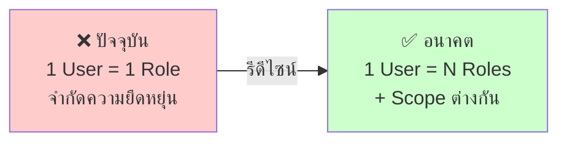
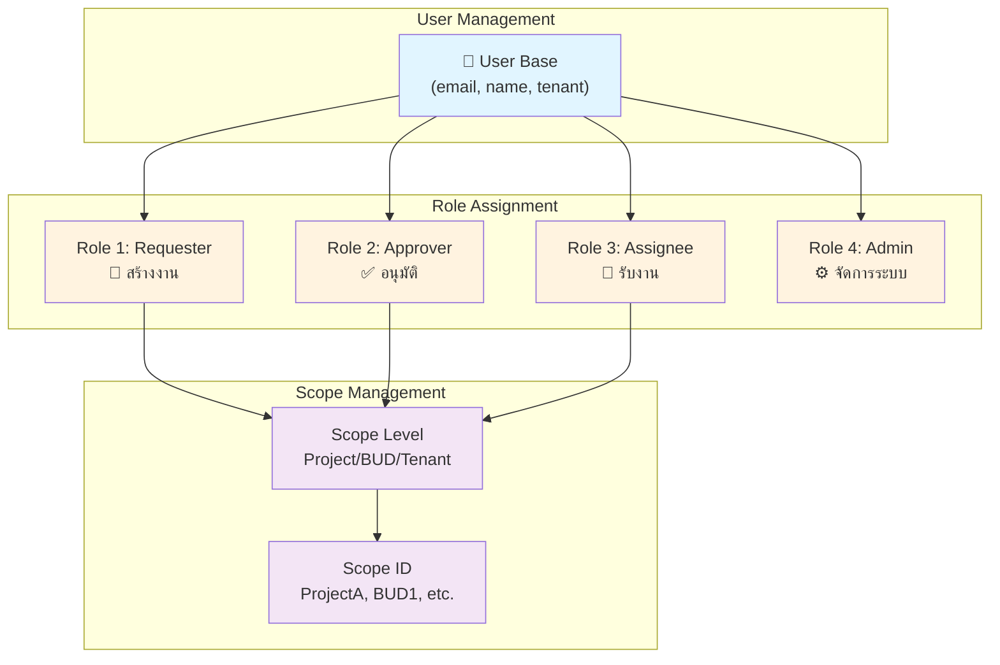
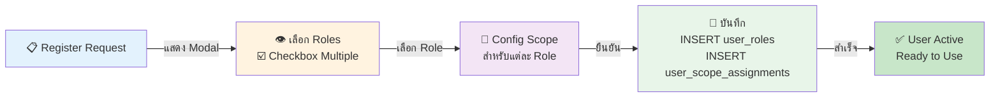
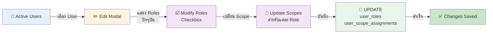
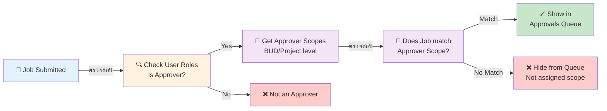
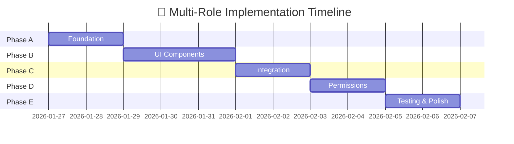

# 🎯 แผนพัฒนา Multi-Role Support System

**สถานะ**: ร่างขั้นตอนการพัฒนา  
**วันที่อัปเดต**: 26 มกราคม 2026  
**ระยะเวลาประมาณ**: 20-26 ชั่วโมง

---

## 📋 สารบัญ

1. [ภาพรวมระบบ](#ภาพรวมระบบ)
2. [โครงสร้างข้อมูล](#โครงสร้างข้อมูล)
3. [ขั้นตอน Workflow](#ขั้นตอนworkflow)
4. [สถาปัตยกรรม Component](#สถาปัตยกรรมcomponent)
5. [API Endpoints](#apiendpoints)
6. [Queries ฐานข้อมูล](#queriesฐานข้อมูล)
7. [การตรวจสอบสิทธิ์](#การตรวจสอบสิทธิ์)
8. [ขั้นตอนการพัฒนา](#ขั้นตอนการพัฒนา)
9. [Timeline และประมาณการ](#timelineและประมาณการ)
10. [จุดตัดสินใจสำคัญ](#จุดตัดสินใจสำคัญ)

---

## ภาพรวมระบบ

### ปัญหาที่แก้



### โครงสร้างหลัก



---

## โครงสร้างข้อมูล

### ตารางฐานข้อมูล

```
┌─────────────────────────────────────┐
│ users (ฐานข้อมูลผู้ใช้)             │
├─────────────────────────────────────┤
│ id (PK)                             │
│ email, name, tenant_id              │
│ password_hash, is_active             │
│ created_at, updated_at              │
└─────────────────────────────────────┘
         ↓ (1:N)
┌──────────────────────────────────────────┐
│ user_roles (บทบาทของผู้ใช้)             │
├──────────────────────────────────────────┤
│ id (PK)                                 │
│ user_id (FK → users)                    │
│ tenant_id (FK → tenants)                │
│ role_name (admin/requester/approver...) │
│ is_active, assigned_by, assigned_at     │
│ created_at, updated_at                  │
└──────────────────────────────────────────┘
         ↓ (1:N)
┌──────────────────────────────────────────────────┐
│ user_scope_assignments (กำหนด Scope ให้แต่ละRole)│
├──────────────────────────────────────────────────┤
│ id (PK)                                         │
│ user_id (FK → users)                            │
│ tenant_id (FK → tenants)                        │
│ role_type (requester/approver/assignee)         │
│ scope_level (Tenant/BUD/Project)                │
│ scope_id (FK → projects/buds)                   │
│ is_active, assigned_by, assigned_at             │
│ created_at, updated_at                          │
└──────────────────────────────────────────────────┘
```

### ตัวอย่างข้อมูล User ที่มี Multi-Role

```javascript
{
  "id": 5,
  "email": "john@company.com",
  "name": "John Doe",
  "roles": [
    {
      "id": 1,
      "name": "requester",
      "isActive": true,
      "scopes": [
        { "id": 10, "level": "project", "scopeId": "ProjectA", "scopeName": "Project A" },
        { "id": 11, "level": "project", "scopeId": "ProjectB", "scopeName": "Project B" }
      ]
    },
    {
      "id": 2,
      "name": "approver",
      "isActive": true,
      "scopes": [
        { "id": 20, "level": "bud", "scopeId": "BUD1", "scopeName": "BUD 1" }
      ]
    },
    {
      "id": 3,
      "name": "assignee",
      "isActive": true,
      "scopes": [
        { "id": 30, "level": "tenant", "scopeId": "TENANT1", "scopeName": "บริษัท XYZ" }
      ]
    }
  ]
}
```

---

## ขั้นตอนWorkflow

### Workflow 1: Pending Registrations (ผู้ดูแลรับสมัคร)



### UI: Pending Registrations Modal (ใหม่)

```
┌─────────────────────────────────────────────┐
│ ✏️ Approve New Registration                 │
├─────────────────────────────────────────────┤
│                                             │
│ Name: John Doe                              │
│ Email: john@company.com                     │
│                                             │
│ ┌───── SELECT ROLES ────────────────────┐   │
│ │ ☑️ Admin  (no scope needed)           │   │
│ │ ☑️ Requester    [Configure ▼]        │   │
│ │ ☐ Approver      [Configure ▼]        │   │
│ │ ☐ Assignee      [Configure ▼]        │   │
│ └───────────────────────────────────────┘   │
│                                             │
│ ┌───── REQUESTER SCOPE ────────────────┐   │
│ │ Scope Level: [Project ▼]             │   │
│ │                                       │   │
│ │ ☑ ProjectA    ☑ ProjectB   ☐ ProjectC│   │
│ │                                       │   │
│ │ [Collapse ▲]                          │   │
│ └───────────────────────────────────────┘   │
│                                             │
│ [Cancel] [Approve]                          │
└─────────────────────────────────────────────┘
```

---

### Workflow 2: Active Users - Edit Profile (แก้ไขผู้ใช้ที่มีอยู่)



### UI: Edit User Modal (แก้ไข)

```
┌─────────────────────────────────────────────────┐
│ ✏️ Edit User                                    │
├─────────────────────────────────────────────────┤
│                                                 │
│ Name: John Doe                                  │
│ Email: john@test.com                            │
│ Department: Engineering                         │
│                                                 │
│ ╔════ ROLES & SCOPES MANAGEMENT ═════════════╗  │
│ ║                                             ║  │
│ ║ ROLE SELECTION:                             ║  │
│ ║ ☑ Admin       (global access)               ║  │
│ ║ ☑ Requester   [Expand ▼]                    ║  │
│ ║ ☑ Approver    [Expand ▼]                    ║  │
│ ║ ☐ Assignee    [Expand ▼]                    ║  │
│ ║                                             ║  │
│ ║ ─── REQUESTER SCOPE CONFIG ────────────     ║  │
│ ║ │ Scope Level: [Project ▼]                 │  │
│ ║ │ Can create jobs in:                       │  │
│ ║ │ ☑ ProjectA    ☑ ProjectB    ☐ ProjectC   │  │
│ ║ │                                          │  │
│ ║ │ [Collapse ▲]                              │  │
│ ║ │                                          │  │
│ ║ ─── APPROVER SCOPE CONFIG ───────────────   ║  │
│ ║ │ Scope Level: [BUD ▼]                     │  │
│ ║ │ Can approve in: [BUD1 ▼]                 │  │
│ ║ │                                          │  │
│ ║ │ [Collapse ▲]                              │  │
│ ║                                             ║  │
│ ╚═════════════════════════════════════════════╝  │
│                                                 │
│ [Cancel] [Save Changes]                         │
└─────────────────────────────────────────────────┘
```

---

### Workflow 3: Approval Flow (อนุมัติงาน)



---

## สถาปัตยกรรมComponent

### Component Tree Structure

```
UserManagement.jsx (📦 Main Container)
│
├─ 🔵 PendingRegistrations.jsx (Tab)
│  └─ RegistrationApprovalModal.jsx ⭐ NEW
│     ├─ RoleSelectionCheckbox.jsx ⭐ NEW
│     │  └─ Role checkboxes (admin, requester, etc.)
│     │
│     └─ ScopeConfigPanel.jsx ⭐ NEW
│        ├─ RequesterScopeConfig.jsx ⭐ NEW
│        │  └─ Project/BUD selector
│        ├─ ApproverScopeConfig.jsx ⭐ NEW
│        │  └─ BUD/Tenant selector
│        └─ AssigneeScopeConfig.jsx ⭐ NEW
│           └─ BUD/Tenant selector
│
├─ 🟢 ActiveUsers.jsx (Tab)
│  └─ EditUserModal.jsx (MODIFY - อยู่แล้ว)
│     ├─ RoleSelectionCheckbox.jsx ✓ reuse
│     │
│     └─ ScopeConfigPanel.jsx ✓ reuse
│        ├─ RequesterScopeConfig.jsx ✓ reuse
│        ├─ ApproverScopeConfig.jsx ✓ reuse
│        └─ AssigneeScopeConfig.jsx ✓ reuse
│
├─ 🟡 PendingApprovals.jsx
├─ 🔴 RejectedUsers.jsx
└─ 🟣 ... other tabs
```

### Component Specifications

#### 1️⃣ RoleSelectionCheckbox.jsx
```javascript
// Props
{
  availableRoles: ["admin", "requester", "approver", "assignee"],
  selectedRoles: ["requester", "approver"],
  onChange: (roles) => {}
}

// Renders
- Checkbox list ของ roles
- Enable/disable based on permissions
- Show role descriptions
```

#### 2️⃣ ScopeConfigPanel.jsx
```javascript
// Props
{
  selectedRoles: ["requester", "approver"],
  roleConfigs: {
    requester: { level: "project", scopes: ["ProjectA", "ProjectB"] },
    approver: { level: "bud", scopes: ["BUD1"] }
  },
  onConfigChange: (roleConfigs) => {}
}

// Features
- Dynamic rendering based on selected roles
- Each role shows/hides config form
- Save button per role
```

#### 3️⃣ RequesterScopeConfig.jsx
```javascript
// Props
{
  role: "requester",
  currentScopes: ["ProjectA", "ProjectB"],
  scopeLevel: "project",
  availableScopes: [
    { id: "ProjectA", name: "Project A" },
    { id: "ProjectB", name: "Project B" },
    { id: "ProjectC", name: "Project C" }
  ],
  onScopeChange: (scopes) => {}
}

// UI
- Dropdown: Scope Level [Project/BUD/Tenant]
- Checkboxes: Select multiple projects/BUDs
- Preview of selected scopes
```

---

## APIEndpoints

### 1. Get User with Roles & Scopes
```http
GET /api/admin/users/:userId

Response 200:
{
  "id": 5,
  "email": "john@test.com",
  "name": "John Doe",
  "roles": [
    {
      "id": 1,
      "name": "requester",
      "isActive": true,
      "scopes": [
        { "id": 10, "level": "project", "scopeId": "ProjectA" }
      ]
    },
    {
      "id": 2,
      "name": "approver",
      "isActive": true,
      "scopes": [
        { "id": 20, "level": "bud", "scopeId": "BUD1" }
      ]
    }
  ]
}
```

### 2. Save Multiple Roles with Scopes
```http
POST /api/admin/users/:userId/roles
PATCH /api/admin/users/:userId/roles

Request:
{
  "roles": [
    {
      "name": "requester",
      "isActive": true,
      "scopes": [
        { "level": "project", "scopeId": "ProjectA" },
        { "level": "project", "scopeId": "ProjectB" }
      ]
    },
    {
      "name": "approver",
      "isActive": true,
      "scopes": [
        { "level": "bud", "scopeId": "BUD1" }
      ]
    }
  ]
}

Response 200:
{
  "success": true,
  "message": "บันทึกบทบาทสำเร็จ",
  "user": { ...updated user object... }
}
```

### 3. Get Available Scopes
```http
GET /api/admin/scopes?scopeLevel=project&tenantId=TENANT1

Response 200:
{
  "projects": [
    { "id": "ProjectA", "name": "Project A" },
    { "id": "ProjectB", "name": "Project B" },
    { "id": "ProjectC", "name": "Project C" }
  ],
  "buds": [
    { "id": "BUD1", "name": "BUD 1" },
    { "id": "BUD2", "name": "BUD 2" }
  ]
}
```

### 4. Approve Registration with Roles
```http
POST /api/admin/registrations/:registrationId/approve

Request:
{
  "status": "approved",
  "roles": [
    {
      "name": "requester",
      "scopes": [
        { "level": "project", "scopeId": "ProjectA" }
      ]
    }
  ]
}

Response 200:
{
  "success": true,
  "message": "อนุมัติการลงทะเบียนสำเร็จ",
  "userId": 5
}
```

---

## Queriesฐานข้อมูล

### Query 1: Get User with All Roles & Scopes
```sql
SELECT 
  u.id,
  u.email,
  u.name,
  json_agg(
    json_build_object(
      'id', ur.id,
      'name', ur.role_name,
      'isActive', ur.is_active,
      'scopes', COALESCE(
        json_agg(
          json_build_object(
            'id', usa.id,
            'level', usa.scope_level,
            'scopeId', usa.scope_id,
            'scopeName', usa.scope_name
          )
        ) FILTER (WHERE usa.id IS NOT NULL),
        '[]'::json
      )
    ) ORDER BY ur.role_name
  ) as roles
FROM users u
LEFT JOIN user_roles ur 
  ON u.id = ur.user_id 
  AND ur.is_active = true
LEFT JOIN user_scope_assignments usa 
  ON u.id = usa.user_id 
  AND ur.role_name = usa.role_type
  AND usa.is_active = true
WHERE u.id = $1
  AND u.tenant_id = $2
GROUP BY u.id, u.email, u.name;
```

### Query 2: Check User Can Create Job in Project
```sql
-- ตรวจสอบว่า User มี Requester role และ scope ถูกต้อง
SELECT EXISTS(
  SELECT 1
  FROM user_roles ur
  INNER JOIN user_scope_assignments usa 
    ON ur.user_id = usa.user_id
    AND ur.role_name = usa.role_type
  WHERE ur.user_id = $1
    AND ur.tenant_id = $2
    AND ur.role_name = 'requester'
    AND ur.is_active = true
    AND usa.is_active = true
    AND (
      -- Project-level scope
      (usa.scope_level = 'project' AND usa.scope_id = $3)
      -- BUD-level scope (check project's BUD)
      OR (usa.scope_level = 'bud' AND EXISTS(
        SELECT 1 FROM projects 
        WHERE id = $3 AND bud_id = usa.scope_id
      ))
      -- Tenant-level scope (full access)
      OR usa.scope_level = 'tenant'
    )
) as can_create;
```

### Query 3: Get Approvers for a BUD
```sql
-- ดึง approvers ที่มี scope ตรงกับ BUD นี้
SELECT DISTINCT
  u.id,
  u.name,
  u.email,
  json_agg(
    json_build_object(
      'level', usa.scope_level,
      'scopeId', usa.scope_id
    )
  ) as scopes
FROM users u
INNER JOIN user_roles ur 
  ON u.id = ur.user_id
  AND ur.role_name = 'approver'
  AND ur.is_active = true
INNER JOIN user_scope_assignments usa 
  ON u.id = usa.user_id
  AND ur.role_name = usa.role_type
  AND usa.is_active = true
WHERE u.tenant_id = $1
  AND (
    (usa.scope_level = 'bud' AND usa.scope_id = $2)
    OR usa.scope_level = 'tenant'
  )
GROUP BY u.id, u.name, u.email;
```

### Query 4: Save Multiple Roles (Transaction)
```sql
-- Transaction เพื่อบันทึก roles และ scopes
BEGIN;

-- Step 1: ลบ roles และ scopes เก่า
DELETE FROM user_scope_assignments 
WHERE user_id = $1 AND tenant_id = $2;

DELETE FROM user_roles 
WHERE user_id = $1 AND tenant_id = $2;

-- Step 2: Insert roles ใหม่
INSERT INTO user_roles (user_id, tenant_id, role_name, assigned_by, is_active)
VALUES 
  ($1, $2, 'requester', $3, true),
  ($1, $2, 'approver', $3, true);

-- Step 3: Insert scopes ใหม่
INSERT INTO user_scope_assignments 
  (user_id, tenant_id, role_type, scope_level, scope_id, scope_name, assigned_by, is_active)
VALUES 
  ($1, $2, 'requester', 'project', 'ProjectA', 'Project A', $3, true),
  ($1, $2, 'requester', 'project', 'ProjectB', 'Project B', $3, true),
  ($1, $2, 'approver', 'bud', 'BUD1', 'BUD 1', $3, true);

COMMIT;
```

---

## การตรวจสอบสิทธิ์

### Helper Functions (Frontend)

```javascript
// 📝 ไฟล์: authStore.js หรือ permission.utils.js

/**
 * ตรวจสอบว่า user มี role ที่ระบุ
 */
export const hasRole = (user, roleName) => 
  user?.roles?.some(r => r.name === roleName && r.isActive);

/**
 * ตรวจสอบว่า user มี role และ scope ที่ระบุ
 */
export const hasRoleWithScope = (user, roleName, scopeLevel, scopeId) => {
  const role = user?.roles?.find(r => r.name === roleName && r.isActive);
  if (!role) return false;
  
  return role.scopes?.some(scope => 
    scope.level === scopeLevel && 
    (scope.scopeId === scopeId || scope.level === 'tenant')
  );
};

/**
 * ตรวจสอบว่า user สามารถสร้าง Job ในโครงการนี้ได้หรือไม่
 */
export const canCreateJobInProject = (user, projectId, projectBudId) => {
  return hasRoleWithScope(user, 'requester', 'project', projectId) ||
         hasRoleWithScope(user, 'requester', 'bud', projectBudId) ||
         hasRoleWithScope(user, 'requester', 'tenant', null);
};

/**
 * ตรวจสอบว่า user สามารถอนุมัติใน BUD นี้ได้หรือไม่
 */
export const canApproveInBud = (user, budId) => {
  return hasRoleWithScope(user, 'approver', 'bud', budId) ||
         hasRoleWithScope(user, 'approver', 'tenant', null);
};
```

### Usage Examples

```javascript
// ❌ OLD (Single Role) - ลบทิ้ง
if (user.role === 'requester') { }

// ✅ NEW (Multi-Role)
if (hasRole(user, 'requester')) { }

// ✅ Check scope
if (canCreateJobInProject(user, projectId, projectBudId)) {
  // Allow job creation
}

// ✅ Check approval scope
if (canApproveInBud(user, budId)) {
  // Show job in approval queue
}
```

### Files ที่ต้องอัปเดต Permission Checks

| ไฟล์ | สิ่งที่ต้องแก้ | Priority |
|------|----------|----------|
| `CreateJobPage.jsx` | Check `canCreateJobInProject()` | 🔴 Critical |
| `ApprovalsQueue.jsx` | Filter jobs by approver scopes | 🔴 Critical |
| `Header.jsx` | Display roles, role switcher | 🟡 High |
| `Dashboard.jsx` | Show cards based on user roles | 🟡 High |
| `JobDetail.jsx` | Show approval action if has scope | 🟡 High |
| `RoleSwitcher.jsx` | Select from multiple roles | 🟡 High |
| `UserPortal.jsx` | Check portal access | 🟡 High |
| `ApprovalFlow.jsx` | Filter approvers by scope | 🟡 High |
| `UserManagement.jsx` | Edit roles UI | 🟠 Medium |
| `NotificationSettings.jsx` | Scope-based notifications | 🟠 Medium |

---

## ขั้นตอนการพัฒนา

### ✅ Phase A: Foundation (ฐานรากระบบ)

**ระยะเวลา**: 6-8 ชั่วโมง  
**เป้าหมาย**: ข้อมูล structure, API, helper functions พร้อมใช้

#### Tasks:
- [ ] 1.1 สร้าง `permission.utils.js` - Helper functions
- [ ] 1.2 Update `authStore.js` - User object structure
- [ ] 1.3 Create API endpoint GET `/api/admin/users/:userId`
- [ ] 1.4 Create API endpoint POST `/api/admin/users/:userId/roles`
- [ ] 1.5 Create API endpoint GET `/api/admin/scopes`
- [ ] 1.6 Test all endpoints with Postman/Thunder Client

---

### 🟡 Phase B: UI Components - Scope Management (อินเทอร์เฟส)

**ระยะเวลา**: 8-10 ชั่วโมง  
**เป้าหมาย**: Components สำหรับเลือก roles และ scopes

#### Tasks:
- [ ] 2.1 สร้าง `RoleSelectionCheckbox.jsx`
- [ ] 2.2 สร้าง `RequesterScopeConfig.jsx`
- [ ] 2.3 สร้าง `ApproverScopeConfig.jsx`
- [ ] 2.4 สร้าง `AssigneeScopeConfig.jsx`
- [ ] 2.5 สร้าง `ScopeConfigPanel.jsx` (container)
- [ ] 2.6 สร้าง `ScopePreview.jsx` - แสดง summary
- [ ] 2.7 Test components ในแต่ละอัน

---

### 🟠 Phase C: Integration & Modal (การรวมทั้งระบบ) ✅ COMPLETED

**ระยะเวลา**: 6-8 ชั่วโมง  
**เป้าหมาย**: Modal ที่สมบูรณ์ + ผสาน components

#### Tasks:
- [x] 3.1 Update `EditUserModal.jsx` - ใช้ components ใหม่ ✅
- [x] 3.2 สร้าง `RegistrationApprovalModal.jsx` - ใช้ใน approveModal ✅
- [x] 3.3 Update `PendingRegistrations.jsx` - ใช้ modal ใหม่ ✅
- [x] 3.4 Update `ActiveUsers.jsx` - ใช้ modal แก้ไข ✅
- [x] 3.5 Test modal ทั้งหมด ✅
- [x] 3.6 Add error handling & loading states ✅

---

### 🟢 Phase D: Permission System (ระบบการตรวจสอบสิทธิ์) ✅ COMPLETED

**ระยะเวลา**: 6-8 ชั่วโมง  
**เป้าหมาย**: อัปเดต permission checks ทั่ว frontend

#### Tasks:
- [x] 4.1 Update `CreateJobPage.jsx` - Check `getAccessibleProjects()` ✅
- [x] 4.2 Update `ApprovalsQueue.jsx` - Filter by approver scopes (ใช้ scopeHelpers อยู่แล้ว) ✅
- [x] 4.3 Update `Header.jsx` - Multi-Role display ✅
- [x] 4.4 Update `Dashboard.jsx` - Role-based cards (Uses api.getJobsByRole already) ✅
- [x] 4.5 Update `scopeHelpers.js` - เพิ่ม Multi-Role functions ✅
- [x] 4.6 Update `ApprovalFlow.jsx` - Scope-aware approvers ✅
- [x] 4.7 Build test passed ✅

---

### 🔵 Phase E: Testing & Polish (ทดสอบและสกัดปรับปรุง)

**ระยะเวลา**: 4-6 ชั่วโมง  
**เป้าหมาย**: ระบบ stable, UI smooth, error handling

#### Tasks:
- [ ] 5.1 Unit tests - Helper functions
- [ ] 5.2 Integration tests - API + Database
- [ ] 5.3 E2E tests - User creation → Job creation → Approval
- [ ] 5.4 UI/UX polish - Animations, error messages
- [ ] 5.5 Performance optimization
- [ ] 5.6 Documentation update

---

## Timelineและประมาณการ

### Breakdown by Phase



### Detailed Estimate

| Phase | Tasks | Estimate | Buffer | Total |
|-------|-------|----------|--------|-------|
| A. Foundation | 6 | 6-8h | 1h | 7-9h |
| B. UI Components | 7 | 8-10h | 1h | 9-11h |
| C. Integration | 6 | 6-8h | 1h | 7-9h |
| D. Permissions | 7 | 6-8h | 1h | 7-9h |
| E. Testing | 6 | 4-6h | 1h | 5-7h |
| **TOTAL** | **32** | **30-40h** | **5h** | **35-45h** |

---

## จุดตัดสินใจสำคัญ

### ❓ Decision 1: Role Switching UI

User ที่มี multi-role ควรเห็นอะไร?

```
Option A: Role Switcher ✨ (แนะนำ)
├─ Show dropdown: "ปัจจุบัน: Requester"
├─ User เลือก role ที่ใช้งานในขณะนี้
├─ Backend track current_active_role
├─ Pros: UI ไม่สับสน, logic ง่าย
└─ Cons: User ต้องสลับ role เมื่อต้อง

Option B: Merge All Permissions
├─ Show all buttons/options จากทุก role
├─ User see combined functionality
├─ Backend merge all scopes
├─ Pros: Powerful, no switching needed
└─ Cons: UI crowded, confusing, complex logic
```

**✅ แนะนำ: Option A** (Role Switcher)

---

### ❓ Decision 2: Default Scope for New Users

เมื่อ admin กำหนด role "Requester" ให้ user ใหม่

```
Option A: Default to Tenant-level (full access)
├─ User สามารถสร้าง job ทุกโครงการ
├─ Pros: Easy setup
└─ Cons: Risky (less control)

Option B: Force Admin to Select Projects
├─ Admin ต้องระบุ project/BUD อย่างชัดแจ้ง
├─ Pros: Secure, granular control
└─ Cons: Admin work more

Option C: Empty (No Permissions)
├─ User ได้ role แต่ยังไม่มี scope
├─ Pros: Most secure
└─ Cons: User confused, can't do anything
```

**✅ แนะนำ: Option B** (Force selection - more secure)

---

### ❓ Decision 3: Approval Queue Display

ถ้า user เป็น Approver สำหรับหลาย BUD

```
Option A: Show All Jobs (flat list) ✨
├─ Display ทุก jobs ที่ user สามารถอนุมัติ
├─ Add filter/search by BUD
├─ Pros: Unified view
└─ Cons: Many items, confusing

Option B: Split by BUD (grouped)
├─ Group jobs by BUD
├─ User see separate sections
├─ Pros: Organized, easy to scan
└─ Cons: More clicks

Option C: Filter Required (start empty)
├─ User pick BUD first, then see jobs
├─ Pros: Focused view
└─ Cons: Extra step every time
```

**✅ แนะนำ: Option A + Filters** (Best UX)

---

## สถานะปัจจุบัน

### ✅ Already Done (ฐานรากเสร็จแล้ว)
- ✅ Database tables: `user_roles`, `user_scope_assignments`
- ✅ Migration scripts: 002, 004, 005, 006
- ✅ Role changed: marketing → requester
- ✅ Basic role checks in some components

### ⏳ Pending Implementation
- ⏳ Helper functions & permission utilities
- ⏳ Multi-role UI components
- ⏳ Pending/Active user modals
- ⏳ Permission checks throughout frontend
- ⏳ Approval flow scope filtering
- ⏳ Testing & bug fixes

---

## Next Steps

### 🎯 ต่อไปนี้:

1. **✅ ตรวจสอบแผนนี้** - ตกลงกับ flow, scope, timeline หรือไม่?
2. **🚀 เริ่ม Phase A** - Foundation APIs & helpers
3. **📝 สร้าง tasks** ใน Jira/GitHub Issues
4. **👥 สัมมนา Phase B** - ก่อน dev component

---

## เอกสารอ้างอิง

| Ref | ไฟล์ | Purpose |
|-----|------|---------|
| ER Diagram | `002_create_user_roles_and_assignments.sql` | Database schema |
| Current State | `IMPLEMENTATION_PLAN.md` | Phase 1-3 status |
| API Spec | `docs/03-architecture/API_SPEC.md` | API standards |
| Database | `database/schema.sql` | Full DB schema |

---

**สร้างเมื่อ**: 26 มกราคม 2026  
**เวอร์ชัน**: 1.0  
**สถานะ**: 📝 ร่างขั้นตอนการพัฒนา
