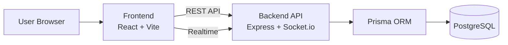

# DJ System - Design Job Management System

<!-- README-I18N:START -->

[ไทย](./README.md) | **English**

<!-- README-I18N:END -->

A design job management platform for Marketing and Creative teams.
Supports job requests, multi-level approvals, SLA tracking, activity timeline, and real-time notifications.

## Project Status

- Current status: Active Development / Production Deployment
- Core structure: Frontend + Backend API + PostgreSQL + Socket.io
- Data architecture: Prisma ORM on PostgreSQL, with compatibility handling for legacy data paths

## Tech Stack (Current)

### Frontend

- React 19 + Vite
- Tailwind CSS 4
- Zustand
- React Router
- Axios
- Socket.io Client
- Heroicons / MUI (partial usage)

### Backend

- Node.js + Express
- Prisma ORM
- PostgreSQL
- JWT Authentication
- Socket.io
- Multer / Sharp

## Architecture (Summary)



Note: The system includes both legacy and modern data paths, so compatibility adaptation is used in selected routes.

## Repository Structure

```text
DJ-System/
├── frontend/                    # React + Vite app
├── backend/
│   ├── api-server/              # Express API + Socket.io
│   └── prisma/                  # Prisma schema / seed
├── database/                    # SQL schema + migrations
├── docs/                        # Project documentation
├── docker-compose.yml           # Development (PostgreSQL service)
└── docker-compose.prod.yml      # Production stack (PostgreSQL + Backend + Frontend)
```

## Core Features

- Dashboard and KPI views
- Create Job + Validation + SLA Preview
- Job List + Filter + Search
- Job Detail + Activity History + Comments
- Approval Queue and Approval Flow
- Admin Management (Job Types, SLA, Holiday, Flow)
- Media Portal / User Portal
- Real-time Notifications (Socket.io)

## Quick Start (Local Development)

### 1) Install dependencies

```bash
# Backend API
cd backend/api-server
npm install

# Frontend
cd ../../frontend
npm install
```

### 2) Setup environment

```bash
# Backend env
cp backend/api-server/.env.example backend/api-server/.env

# Optional: Frontend env
cp frontend/.env.local frontend/.env
```

Update environment values, especially `DATABASE_URL`, to match your local machine.

### 3) Start services

```bash
# Start backend (default: http://localhost:3000)
cd backend/api-server
npm run dev

# Start frontend (default: http://localhost:5173)
cd ../../frontend
npm run dev
```

### 4) Health checks

- Frontend: http://localhost:5173
- Backend: http://localhost:3000
- Backend Health: http://localhost:3000/health

## Docker Usage

### Development database only

```bash
docker compose up -d
```

[docker-compose.yml](docker-compose.yml) is intended for development PostgreSQL.

### Production stack

```bash
docker compose -f docker-compose.prod.yml up -d --build
```

[docker-compose.prod.yml](docker-compose.prod.yml) runs PostgreSQL + Backend + Frontend together.

## Common Commands

### Frontend

```bash
cd frontend
npm run dev
npm run build
npm run lint
```

### Backend

```bash
cd backend/api-server
npm run dev
npm run test
npm run build:v2
```

### Prisma

```bash
cd backend/prisma
npx prisma generate
npx prisma migrate dev --name <migration_name>
npx prisma db push
```

## Environment Variables (Quick)

Required before running the app:

- Backend: `DATABASE_URL`, `JWT_SECRET`, `ALLOWED_ORIGINS`, `PORT`
- Frontend: `VITE_API_URL`

Full variable reference (including production examples, email, storage, and feature flags):

- [docs/reference/ENVIRONMENT_VARIABLES.md](docs/reference/ENVIRONMENT_VARIABLES.md)

Security notes:

- Never commit real secrets to Git.
- Use `.env.example` as a template, then set environment-specific values.

## User Roles

1. Requester: Create jobs, edit briefs, track progress
2. Approver: Approve/reject and manage approval steps
3. Assignee: Execute jobs, update status, deliver output, comment
4. Admin: Manage master data, SLA, flows, and permissions

## Job Flow (High-Level)

```text
draft -> pending_approval -> approved -> assigned -> in_progress -> completed

alternative paths:
- rejected
- pending_rejection / rejected_by_assignee
- cancelled
```

## Troubleshooting

### Backend cannot connect to database

- Verify `DATABASE_URL` in `.env`
- Ensure PostgreSQL is running
- Check `/health`

### CORS error from frontend

- Ensure `ALLOWED_ORIGINS` includes `http://localhost:5173`
- Restart backend after `.env` changes

### Socket connection issues

- Verify frontend token/session
- Check browser console and backend logs

### Prisma client out of sync

```bash
cd backend/prisma
npx prisma generate
```

More troubleshooting docs:

- [docs/LOCAL_DATABASE_SETUP.md](docs/LOCAL_DATABASE_SETUP.md)
- [docs/TROUBLESHOOTING_502_JOBS_DETAIL.md](docs/TROUBLESHOOTING_502_JOBS_DETAIL.md)

## Documentation

- [docs/README.md](docs/README.md)
- [docs/architecture/README.md](docs/architecture/README.md)
- [docs/workflows/README.md](docs/workflows/README.md)
- [docs/api/README.md](docs/api/README.md)
- [database/schema.sql](database/schema.sql)

## License

Copyright (c) SENA Development PCL

---

Last Updated: 2026-04-16
