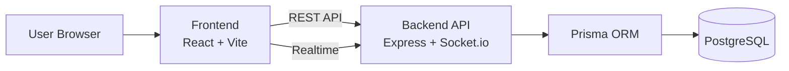

# DJ System - Design Job Management System

<!-- README-I18N:START -->

**ไทย** | [English](./README.en.md)

<!-- README-I18N:END -->

ระบบจัดการงานออกแบบ (Design Job) สำหรับทีม Marketing และ Creative
รองรับการสร้างงาน, Workflow อนุมัติหลายระดับ, SLA Tracking, Activity Timeline และการแจ้งเตือนแบบ Real-time

## Project Status

- สถานะปัจจุบัน: Active Development / Production Deployment
- โครงสร้างหลัก: Frontend + Backend API + PostgreSQL + Socket.io
- สถาปัตยกรรมข้อมูล: ใช้ Prisma ORM กับฐานข้อมูล PostgreSQL (มี compatibility layer สำหรับข้อมูลเดิมบางส่วน)

## Tech Stack (Current)

### Frontend

- React 19 + Vite
- Tailwind CSS 4
- Zustand
- React Router
- Axios
- Socket.io Client
- Heroicons / MUI (บางส่วน)

### Backend

- Node.js + Express
- Prisma ORM
- PostgreSQL
- JWT Authentication
- Socket.io
- Multer / Sharp

## Architecture (Summary)



หมายเหตุ: ระบบมีทั้งข้อมูลยุคเก่าและข้อมูลใหม่ จึงมี layer สำหรับแปลง/รองรับความเข้ากันได้ในบางเส้นทาง

## Repository Structure

```text
DJ-System/
├── frontend/                    # React + Vite app
├── backend/
│   ├── api-server/              # Express API + Socket.io
│   └── prisma/                  # Prisma schema / seed
├── database/                    # SQL schema + migrations
├── docs/                        # Project documentation
├── docker-compose.yml           # Development (PostgreSQL service)
└── docker-compose.prod.yml      # Production stack (PostgreSQL + Backend + Frontend)
```

## Core Features

- Dashboard และ KPI
- Create Job + Validation + SLA Preview
- Job List + Filter + Search
- Job Detail + Activity History + Comments
- Approval Queue และ Approval Flow
- Admin Management (Job Types, SLA, Holiday, Flow)
- Media Portal / User Portal
- Real-time Notification (Socket.io)

## Quick Start (Local Development)

### 1) Install dependencies

```bash
# Backend API
cd backend/api-server
npm install

# Frontend
cd ../../frontend
npm install
```

### 2) Setup environment

```bash
# Backend env
cp backend/api-server/.env.example backend/api-server/.env

# Optional: Frontend env
cp frontend/.env.local frontend/.env
```

อัปเดตค่า environment โดยเฉพาะ `DATABASE_URL` ให้ตรงกับเครื่องของคุณ

### 3) Start services

```bash
# Start backend (default: http://localhost:3000)
cd backend/api-server
npm run dev

# Start frontend (default: http://localhost:5173)
cd ../../frontend
npm run dev
```

### 4) Health checks

- Frontend: http://localhost:5173
- Backend: http://localhost:3000
- Backend Health: http://localhost:3000/health

## Docker Usage

### Development database only

```bash
docker compose up -d
```

ไฟล์ [docker-compose.yml](docker-compose.yml) ใช้สำหรับ PostgreSQL ในงานพัฒนา

### Development full stack (PostgreSQL + Backend + Frontend)

```bash
docker compose --profile app up -d
```

เมื่อรัน profile `app` แล้ว:
- Frontend: http://localhost:5173
- Backend: http://localhost:3001
- Health: http://localhost:3001/health

### Production stack

```bash
docker compose -f docker-compose.prod.yml up -d --build
```

ไฟล์ [docker-compose.prod.yml](docker-compose.prod.yml) ใช้รัน PostgreSQL + Backend + Frontend พร้อมกัน

## Common Commands

### Frontend

```bash
cd frontend
npm run dev
npm run build
npm run lint
```

### Backend

```bash
cd backend/api-server
npm run dev
npm run test
npm run build:v2
```

### Prisma

```bash
cd backend/prisma
npx prisma generate
npx prisma migrate dev --name <migration_name>
npx prisma db push
```

## Environment Variables (Quick)

ตัวแปรที่ต้องตั้งค่าก่อนรันระบบ:

- Backend: `DATABASE_URL`, `JWT_SECRET`, `ALLOWED_ORIGINS`, `PORT`
- Frontend: `VITE_API_URL`

รายละเอียดทั้งหมด (รวม production example, email, storage, feature flags):

- [docs/reference/ENVIRONMENT_VARIABLES.md](docs/reference/ENVIRONMENT_VARIABLES.md)

ข้อควรระวัง:

- อย่า commit secret จริงลง Git
- ใช้ไฟล์ตัวอย่างจาก `.env.example` แล้วเติมค่าเฉพาะ environment

## User Roles

1. Requester: สร้างงาน, แก้ brief, ติดตามงาน
2. Approver: อนุมัติ/ส่งกลับ/จัดการขั้นตอนอนุมัติ
3. Assignee: รับงาน, อัปเดตสถานะ, ส่งงาน, สื่อสารผ่านคอมเมนต์
4. Admin: จัดการ master data, SLA, flow, และสิทธิ์ใช้งาน

## Job Flow (High-Level)

```text
draft -> pending_approval -> approved -> assigned -> in_progress -> completed

alternative paths:
- rejected
- pending_rejection / rejected_by_assignee
- cancelled
```

## Troubleshooting

### Backend ต่อฐานข้อมูลไม่ได้

- ตรวจค่า `DATABASE_URL` ใน `.env`
- ตรวจว่า PostgreSQL ทำงานอยู่
- ทดสอบ endpoint: `/health`

### CORS error จาก frontend

- ตรวจ `ALLOWED_ORIGINS` ให้รวม `http://localhost:5173`
- restart backend หลังแก้ `.env`

### Socket ไม่เชื่อมต่อ

- ตรวจ token ฝั่ง frontend
- ตรวจ error จาก browser console และ backend logs

### Prisma client ไม่ตรง schema

```bash
cd backend/prisma
npx prisma generate
```

สำหรับ troubleshooting เพิ่มเติม:

- [docs/LOCAL_DATABASE_SETUP.md](docs/LOCAL_DATABASE_SETUP.md)
- [docs/TROUBLESHOOTING_502_JOBS_DETAIL.md](docs/TROUBLESHOOTING_502_JOBS_DETAIL.md)

## Documentation

- [docs/README.md](docs/README.md)
- [docs/architecture/README.md](docs/architecture/README.md)
- [docs/workflows/README.md](docs/workflows/README.md)
- [docs/api/README.md](docs/api/README.md)
- [database/schema.sql](database/schema.sql)

## License

Copyright (c) SENA Development PCL

---

Last Updated: 2026-04-16
