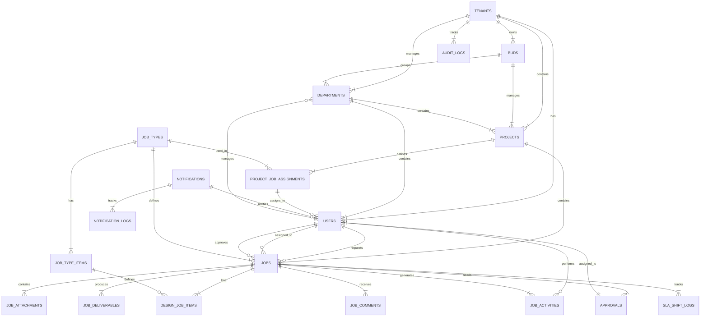
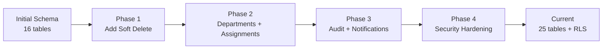

# 🗄️ Database Schema Documentation

## 1. Overview (ภาพรวม)
DJ System uses **PostgreSQL** (via Supabase) with relational data structure.
ระบบ DJ System ใช้ฐานข้อมูล **PostgreSQL** (ผ่าน Supabase) แบบ Relational Database
- **Tenant Isolation:** All main tables have `tenant_id` (แบ่งแยกข้อมูลตามบริษัทด้วย `tenant_id`)
- **Naming Convention:** `snake_case` for tables and columns (ใช้ snake_case สำหรับชื่อตารางและคอลัมน์)
- **Keys:** `id` (Serial) as Primary Key, Foreign Keys explicitly defined (ใช้ id เป็น PK และกำหนด Foreign Key ชัดเจน)

## 2. Core Tables

### 👥 Organization & Users
| Table | Description | Key Columns | Status |
|-------|-------------|-------------|--------|
| `tenants` | บริษัท/องค์กร | `id`, `name`, `subdomain` | ✅ |
| `buds` | Business Units | `id`, `tenant_id`, `name` | ✅ |
| `departments` | แผนก | `id`, `bud_id`, `manager_id` | ✅ |
| `projects` | โครงการ | `id`, `department_id`, `name` | ✅ |
| `users` | ข้อมูลผู้ใช้งาน | `id`, `email`, `role`, `department_id` | ✅ |

### 🛠️ Job Management
| Table | Description | Key Columns | Status |
|-------|-------------|-------------|--------|
| `job_types` | ประเภทงาน Master | `id`, `name`, `sla_days` | ✅ |
| `job_type_items` | รายละเอียดงานย่อย | `id`, `job_type_id`, `name` | ✅ |
| `jobs` | ใบงาน (Transaction) | `id`, `dj_id`, `status`, `requester_id` | ✅ MAIN |
| `design_job_items` | งานย่อยในใบงาน | `id`, `job_id`, `status`, `file_path` | ✅ |
| `activity_logs` | ประวัติการทำงาน | `id`, `job_id`, `action`, `message` | ✅ |
| `approval_flows` | ลำดับการอนุมัติ | `id`, `project_id`, `level`, `approver_id` | ✅ |

### 📋 Additional Tables (Phase 2+)
| Table | Description | Key Columns | Status |
|-------|-------------|-------------|--------|
| `project_job_assignments` | Auto-assignment Matrix | `id`, `project_id`, `job_type_id`, `assignee_id` | ✅ |
| `sla_shift_logs` | SLA Shift Tracking | `id`, `job_id`, `original_due_date`, `new_due_date` | ✅ |
| `audit_logs` | Audit Trail | `id`, `tenant_id`, `table_name`, `action`, `old_value`, `new_value` | ✅ |
| `notification_logs` | Notification Logging | `id`, `notification_id`, `status`, `sent_at` | ✅ |
| `password_reset_requests` | Password Reset Flow | `id`, `user_id`, `token`, `expires_at` | ✅ |

### 🔄 Approval Flow V2 (Template System) - NEW!
| Table | Description | Key Columns | Status |
|-------|-------------|-------------|--------|
| `approval_flow_templates` | Master Template | `id`, `tenant_id`, `name`, `total_levels`, `auto_assign_type` | ✅ NEW |
| `approval_flow_steps` | ขั้นตอนใน Template | `id`, `template_id`, `level`, `approver_type` | ✅ NEW |
| `project_flow_assignments` | ผูก Project+JobType กับ Template | `id`, `project_id`, `job_type_id`, `template_id` | ✅ NEW |
| `project_flow_approvers` | Approver เฉพาะ Project | `id`, `assignment_id`, `level`, `approver_id` | ✅ NEW |

> **📌 V2 Logic:**
> - `project_flow_assignments` รองรับ `job_type_id` = NULL (Default สำหรับทุก JobType)
> - `total_levels = 0` = Skip Approval
> - `auto_assign_type`: `manual`, `team_lead`, `dept_manager`, `specific_user`

---

## 2.1 Multi-Tenant Hierarchy Rules (Strict)

**Hierarchy Chain:** `Tenant` > `Department` > `Project` > `Job`

1.  **Strict Isolation:**
    *   Every query MUST include `WHERE tenant_id = ?`.
    *   Foreign Keys must reference tables within the SAME tenant (except system-wide lookups if any).

2.  **Department-Project Scope:**
    *   `projects` table MUST have `department_id` to enforce ownership.
    *   Access to project is limited to:
        *   Tenant Admin (All)
        *   Department Manager (Own Department)
        *   Project Members (If implemented)

3.  **Auto-Manager Routing Data:**
    *   `departments` table MUST have a valid `manager_id`.
    *   `users` table MUST have `department_id`.
    *   **Logic:** `Job.Requester` -> `User.Department` -> `Department.Manager` = `Default Approver`.

## 3. Prisma ORM Integration

### 🔄 Prisma Schema Status (สถานะ Prisma Schema)

**Update (2026-01-28):** ✅ Schema Mismatch Fixed! (แก้ไขปัญหา Schema ไม่ตรงกันแล้ว)

| Metric | Before | After |
|--------|--------|-------|
| **Prisma Models** | 16 models | 25 models |
| **Missing Tables** | 9 tables | 0 tables ✅ |
| **Job Model** | `DesignJob` → `design_jobs` ❌ | `Job` → `jobs` ✅ |
| **Alignment** | 64% | 100% ✅ |

**What Was Fixed:**
```javascript
// BEFORE ❌
await prisma.designJob.findMany()  // Error: table not found

// AFTER ✅
await prisma.job.findMany()  // Correct!
```

### 📦 Available Prisma Models (25 total)

**Category: Organization (องค์กรและผู้ใช้)**
- `Tenant` → `tenants`
- `Bud` → `buds`
- `Department` → `departments` ✅ NEW
- `Project` → `projects`
- `User` → `users`
- `Role` → `roles`
- `UserRole` → `user_roles`

**Category: Job Management (การจัดการงาน)**
- `JobType` → `job_types`
- `JobTypeItem` → `job_type_items` ✅ NEW
- `Job` → `jobs` ✅ RENAMED (was DesignJob)
- `DesignJobItem` → `design_job_items`
- `JobAttachment` → `job_attachments`
- `JobDeliverable` → `job_deliverables`

**Category: Workflow & Tracking (การอนุมัติและการติดตาม)**
- `ApprovalFlow` → `approval_flows`
- `Approval` → `approvals`
- `ActivityLog` → `activity_logs` ✅ NEW
- `AuditLog` → `audit_logs` ✅ NEW
- `JobComment` → `job_comments`

**Category: Notifications & System (การแจ้งเตือนและระบบ)**
- `Notification` → `notifications`
- `NotificationLog` → `notification_logs` ✅ NEW
- `Holiday` → `holidays`
- `MediaFile` → `media_files`

**Category: Auto-Assignment & SLA (การจ่ายงานอัตโนมัติและ SLA)**
- `ProjectJobAssignment` → `project_job_assignments` ✅ NEW
- `SlaShiftLog` → `sla_shift_logs` ✅ NEW
- `PasswordResetRequest` → `password_reset_requests` ✅ NEW

### 🔗 Relations Support

**Job ↔ User Relations:**
```prisma
// Requester → Job
user.requestedJobs: Job[] @relation("RequesterJobs")

// Assignee → Job
user.assignedJobs: Job[] @relation("AssigneeJobs")

// Job Close/Complete Tracking
user.closeRequestedJobs: Job[] @relation("CloseRequestedJobs")
user.closedJobs: Job[] @relation("ClosedJobs")
user.completedJobs: Job[] @relation("CompletedJobs")
```

**Department Structure:**
```prisma
// Bud → Department
bud.departments: Department[]

// Department → Users
department.users: User[] @relation("UserDepartment")
department.manager: User? @relation("DepartmentManager")
```

**Auto-Assignment:**
```prisma
// Get default assignee for Project + JobType
projectJobAssignment: ProjectJobAssignment @relation(...)
```

### ⚙️ How to Use Prisma Client

```javascript
import { PrismaClient } from '@prisma/client';

const prisma = new PrismaClient();

// ✅ Get job with relations
const job = await prisma.job.findUnique({
  where: { id: 1 },
  include: {
    requester: true,
    assignee: true,
    jobType: true,
    project: true,
    approvals: true,
    activityLogs: true
  }
});

// ✅ Create job with items
const jobWithItems = await prisma.job.create({
  data: {
    tenantId: 1,
    projectId: 1,
    jobTypeId: 1,
    djId: 'DJ-2026-0001',
    subject: 'Design Banner',
    requesterId: 5,
    assigneeId: 3,
    jobItems: {
      create: [
        { name: 'Banner 1920x1080', quantity: 1 },
        { name: 'Banner 1200x630', quantity: 1 }
      ]
    }
  },
  include: { jobItems: true }
});

// ✅ Get activity logs
const logs = await prisma.activityLog.findMany({
  where: { jobId: 1 },
  include: { user: true }
});
```

---

## 3. Phase 2 Requirement Updates

### 3.1 🤖 Auto-Assignment (Matrix)
Logic: จ่ายงานอัตโนมัติโดยดูจาก **Project** + **Job Type**
- Status: ✅ Already implemented in `schema.sql`

```sql
CREATE TABLE IF NOT EXISTS project_job_assignments (
    id SERIAL PRIMARY KEY,
    project_id INTEGER REFERENCES projects(id),
    job_type_id INTEGER REFERENCES job_types(id),
    assignee_id INTEGER REFERENCES users(id), -- Default Assignee
    UNIQUE(project_id, job_type_id)
);
```

### 3.2 🔔 Notifications (New Required)
Logic: แจ้งเตือนเมื่อสถานะเปลี่ยน หรือใกล้ถึงกำหนด SLA
- Status: ✅ **Implemented** (Phase 2 Migration)

```sql
CREATE TABLE IF NOT EXISTS notifications (
    id SERIAL PRIMARY KEY,
    user_id INTEGER REFERENCES users(id),
    type VARCHAR(50), -- 'job_assigned', 'job_approved', 'sla_warning'
    title VARCHAR(255),
    message TEXT,
    job_id INTEGER REFERENCES jobs(id),
    is_read BOOLEAN DEFAULT false,
    created_at TIMESTAMP WITH TIME ZONE DEFAULT NOW()
);
```

### 3.3 ⏱️ SLA Tracking (New Required)
Logic: เก็บ Log การคำนวณและเลื่อน SLA (Shift)
- Status: ✅ **Implemented** (Phase 2 Migration)

```sql
CREATE TABLE IF NOT EXISTS sla_shift_logs (
    id SERIAL PRIMARY KEY,
    job_id INTEGER REFERENCES jobs(id),
    urgent_job_id INTEGER REFERENCES jobs(id), -- สาเหตุที่ทำให้เลื่อน (งานด่วน)
    original_due_date TIMESTAMP WITH TIME ZONE,
    new_due_date TIMESTAMP WITH TIME ZONE,
    shift_days INTEGER, -- จำนวนวันที่เลื่อน
    created_at TIMESTAMP WITH TIME ZONE DEFAULT NOW()
);
```

### 3.4 ⏳ Auto-Start Configuration (Phase 4)
Logic: Configurable Auto-Start timeout per Job Type
- Status: 🟡 **Pending Implementation**

```sql
-- Table: job_types
ALTER TABLE job_types ADD COLUMN auto_start_hours INTEGER DEFAULT 4; -- 0 = Immediate, >0 = Hours delay

-- Index for Performance (Background Job)
CREATE INDEX idx_jobs_status_assigned ON jobs(status) WHERE status = 'assigned';

-- Index for My Queue (Assignee Dashboard)
CREATE INDEX idx_jobs_assignee_status_due ON jobs(assignee_id, status, due_date);
```

## 4. Entity Relationship Diagram (Mermaid)



**Key Relationships:**

| Relationship | Type | Notes |
|--------------|------|-------|
| **1:N** | Tenant → *(User, Project, Job, ...) | Multi-tenancy |
| **N:N** | Job ↔ User (4 roles) | Requester, Assignee, etc. |
| **1:N** | JobType → Job | Job classification |
| **1:N** | Job → DesignJobItem | Sub-items |
| **1:N** | Job → Approval | Sequential approval |
| **1:N** | Job → ActivityLog | Audit trail |
| **1:1** | ProjectJobAssignment | Auto-assignment rule |

---

## 5. Indexes & Performance Optimization

### 5.1 🔍 Primary Indexes

**Core Performance Indexes:**

| Table | Index Name | Columns | Purpose (วัตถุประสงค์) |
|-------|-----------|---------|---------|
| `jobs` | `idx_jobs_tenant_id` | `tenant_id` | Multi-tenancy isolation (การแยกข้อมูลตามบริษัท) |
| `jobs` | `idx_jobs_status` | `status` | Job filtering by status (กรองงานตามสถานะ) |
| `jobs` | `idx_jobs_requester_id` | `requester_id` | User's requested jobs (งานที่ผู้ใช้ขอ) |
| `jobs` | `idx_jobs_assignee_id` | `assignee_id` | User's assigned jobs (งานที่ผู้ใช้ได้รับมอบหมาย) |
| `jobs` | `idx_jobs_due_date` | `due_date` | SLA monitoring (การตรวจสอบ SLA) |
| `jobs` | `idx_jobs_created_at` | `created_at` | Recent jobs query (ค้นหางานล่าสุด) |
| `approvals` | `idx_approvals_tenant_id` | `tenant_id` | Multi-tenancy |
| `approvals` | `idx_approvals_job_id` | `job_id` | Job's approvals |
| `approvals` | `idx_approvals_approver_id` | `approver_id` | Approver's queue |
| `approvals` | `idx_approvals_status` | `status` | Pending approvals |
| `approvals` | `idx_approvals_token` | `approval_token` | Token lookup |

### 5.2 🚀 Composite Indexes

**Multi-Column Indexes for Common Queries:**

```sql
-- Jobs: Assignee Dashboard (My Queue)
CREATE INDEX idx_jobs_assignee_status_due
ON jobs(assignee_id, status, due_date);

-- Jobs: Tenant + Status filter
CREATE INDEX idx_jobs_tenant_status
ON jobs(tenant_id, status);

-- Activity Logs: Tenant + Date range
CREATE INDEX idx_activity_logs_tenant_created
ON activity_logs(tenant_id, created_at DESC);

-- Audit Logs: Entity lookup
CREATE INDEX idx_audit_logs_entity
ON audit_logs(entity_type, entity_id);

-- Audit Logs: User actions
CREATE INDEX idx_audit_logs_user_action
ON audit_logs(user_id, action);
```

### 5.3 📊 Query Performance Guidelines

**Recommended Query Patterns:**

```javascript
// ✅ GOOD: Uses index on (assignee_id, status)
const myJobs = await prisma.job.findMany({
  where: {
    tenantId: 1,
    assigneeId: userId,
    status: { in: ['assigned', 'in_progress'] }
  },
  orderBy: { dueDate: 'asc' }
});

// ⚠️ ACCEPTABLE: Uses partial index
const recentJobs = await prisma.job.findMany({
  where: { tenantId: 1 },
  orderBy: { createdAt: 'desc' },
  take: 20
});

// ❌ AVOID: Full table scan
const allJobs = await prisma.job.findMany({
  where: { subject: { contains: 'design' } } // No index on subject
});
```

**Performance Tips:**
- ✅ Always filter by `tenantId` first
- ✅ Use indexed columns in WHERE clause
- ✅ Limit result set with `take` or pagination
- ⚠️ Avoid `contains` on non-indexed text fields
- ⚠️ Use database full-text search for text searching

---

## 6. Security & RLS Policies

### 6.1 🔒 Row Level Security (RLS)

**All tables have RLS enabled** with strict tenant isolation policies.

**Security Model:**
```sql
-- RLS is enabled on ALL tenant-scoped tables
ALTER TABLE jobs ENABLE ROW LEVEL SECURITY;
ALTER TABLE approvals ENABLE ROW LEVEL SECURITY;
ALTER TABLE users ENABLE ROW LEVEL SECURITY;
-- ... (25 tables total)
```

### 6.2 🛡️ Tenant Isolation Strategy

**Policy Types (รูปแบบ Policy):**

| Strategy | Tables | RLS Policy |
|----------|--------|-----------|
| **Direct Tenant ID** | `jobs`, `users`, etc. | ใช้ `tenant_id` โดยตรง |
| **Via Job ID** | `job_attachments`, etc. | เช็คผ่าน `job_id` ว่าอยู่ใน tenant หรือไม่ |
| **Via User ID** | `activity_logs`, etc. | เช็คผ่าน `user_id` ว่าอยู่ใน tenant หรือไม่ |
| **Via Project ID** | `project_job_assignments` | เช็คผ่าน `project_id` |

**Example Policy:**
```sql
-- Direct tenant isolation (jobs table)
CREATE POLICY "Tenant Isolation" ON jobs
FOR ALL TO authenticated
USING (tenant_id = current_setting('app.tenant_id', true)::INTEGER)
WITH CHECK (tenant_id = current_setting('app.tenant_id', true)::INTEGER);

-- Indirect via job_id (job_attachments table)
CREATE POLICY "Tenant Isolation" ON job_attachments
FOR ALL TO authenticated
USING (job_id IN (
  SELECT id FROM jobs WHERE tenant_id = current_setting('app.tenant_id', true)::INTEGER
));
```

### 6.3 🔑 Application-Level Security

**Setting Tenant Context:**

```javascript
// Backend middleware sets tenant_id for each request
app.use((req, res, next) => {
  const tenantId = req.user.tenantId; // From JWT

  // Set PostgreSQL session variable
  await prisma.$executeRaw`
    SET LOCAL app.tenant_id = ${tenantId}
  `;

  next();
});
```

**Security Guarantees (ความปลอดภัยที่รับรอง):**
- ✅ Users can ONLY access data from their tenant (ผู้ใช้เข้าถึงได้เฉพาะข้อมูลของบริษัทตัวเอง)
- ✅ Cross-tenant queries are BLOCKED at database level (การดึงข้อมูลข้ามบริษัทถูกบล็อกที่ระดับฐานข้อมูล)
- ✅ Even compromised API cannot leak cross-tenant data (แม้ API จะถูกเจาะ ก็ยังดูข้อมูลข้ามบริษัทไม่ได้)
- ✅ All functions use `SET search_path = public` (ป้องกัน SQL Injection ผ่าน search_path)

### 6.4 🚨 Special Security Cases

**Public Insert Tables:**

```sql
-- Password Reset: Allow public insert, but tenant-scoped read
CREATE POLICY "Public Insert Request" ON password_reset_requests
FOR INSERT TO public
WITH CHECK (otp_code IS NOT NULL);

-- User Registration: Allow public insert
CREATE POLICY "Public Register Request" ON user_registration_requests
FOR INSERT TO public
WITH CHECK (email IS NOT NULL);
```

---

## 7. Data Types & Constraints

### 7.1 📏 Field Type Specifications

**Common Field Types:**

| Field Pattern | Type | Max Length | Example |
|--------------|------|------------|---------|
| `id` | `SERIAL` / `INTEGER` | - | 1, 2, 3 |
| `*_id` (FK) | `INTEGER` | - | References to other tables |
| `email` | `VARCHAR` | 255 | user@example.com |
| `name`, `title` | `VARCHAR` | 100-255 | "John Doe" |
| `code` | `VARCHAR` | 20-50 | "BUD-001" |
| `dj_id` | `VARCHAR` | 50 | "DJ-2026-0001" |
| `description`, `comment` | `TEXT` | unlimited | Long text content |
| `status` | `VARCHAR` / `ENUM` | 20-50 | "pending", "approved" |
| `file_path` | `VARCHAR` | 500-1000 | "/uploads/..." |
| `metadata`, `*_values` | `JSONB` | unlimited | `{"key": "value"}` |
| `is_active`, `is_*` | `BOOLEAN` | - | true/false |
| `*_at` (timestamp) | `TIMESTAMPTZ` | - | `2026-01-28 10:30:00+07` |

### 7.2 ⚖️ Validation Constraints

**Unique Constraints:**

```sql
-- Global unique
ALTER TABLE tenants ADD CONSTRAINT tenants_code_unique UNIQUE (code);

-- Tenant-scoped unique
ALTER TABLE jobs ADD CONSTRAINT jobs_tenant_dj_id_unique
  UNIQUE (tenant_id, dj_id);

ALTER TABLE users ADD CONSTRAINT users_tenant_email_unique
  UNIQUE (tenant_id, email);

ALTER TABLE projects ADD CONSTRAINT projects_tenant_code_unique
  UNIQUE (tenant_id, code);
```

**Foreign Key Constraints:**

```sql
-- Cascade delete (when parent deleted, children deleted)
ALTER TABLE users ADD CONSTRAINT users_tenant_fk
  FOREIGN KEY (tenant_id) REFERENCES tenants(id) ON DELETE CASCADE;

-- Set NULL (when parent deleted, FK set to NULL)
ALTER TABLE departments ADD CONSTRAINT departments_manager_fk
  FOREIGN KEY (manager_id) REFERENCES users(id) ON DELETE SET NULL;

-- No Action (prevent deletion if children exist)
ALTER TABLE sla_shift_logs ADD CONSTRAINT sla_urgent_job_fk
  FOREIGN KEY (urgent_job_id) REFERENCES jobs(id) ON DELETE NO ACTION;
```

### 7.3 🎯 Default Values

**Common Defaults:**

```prisma
model Job {
  status      String   @default("draft")
  priority    String   @default("normal")
  isActive    Boolean  @default(true)
  createdAt   DateTime @default(now())
  updatedAt   DateTime @default(now()) @updatedAt

  autoApprovedLevels Json? @default("[]")
  finalFiles         Json? @default("[]")
}
```

---

## 8. Common Query Patterns

### 8.1 🔍 Basic CRUD Operations

**Create Job with Items:**

```javascript
const job = await prisma.job.create({
  data: {
    tenantId: 1,
    projectId: 10,
    jobTypeId: 2,
    djId: 'DJ-2026-0123',
    subject: 'Social Media Banner Design',
    requesterId: 5,
    assigneeId: 8,
    status: 'assigned',
    priority: 'normal',
    dueDate: new Date('2026-02-15'),

    // Create job items
    jobItems: {
      create: [
        { name: 'Facebook Post 1200x630', quantity: 1 },
        { name: 'Instagram Story 1080x1920', quantity: 3 }
      ]
    }
  },
  include: {
    jobItems: true,
    requester: true,
    assignee: true
  }
});
```

**Get Job with Full Relations (ดึงข้อมูลงานพร้อมข้อมูลที่เกี่ยวข้องทั้งหมด):**

```javascript
const job = await prisma.job.findUnique({
  where: { id: jobId },
  include: {
    tenant: true,
    project: true,
    jobType: true,
    requester: { select: { id: true, email: true, firstName: true, lastName: true } },
    assignee: { select: { id: true, email: true, firstName: true, lastName: true } },
    jobItems: true,
    attachments: true,
    deliverables: true,
    approvals: {
      include: { approver: true },
      orderBy: { stepNumber: 'asc' }
    },
    activityLogs: {
      orderBy: { createdAt: 'desc' },
      take: 10
    }
  }
});
```

### 8.2 📋 Dashboard Queries

**Assignee Queue/My Jobs (งานที่ฉันต้องทำ):**

```javascript
const myQueue = await prisma.job.findMany({
  where: {
    tenantId: currentTenantId,
    assigneeId: currentUserId,
    status: { in: ['assigned', 'in_progress'] }
  },
  include: {
    project: true,
    jobType: true,
    requester: true
  },
  orderBy: [
    { priority: 'desc' },  // urgent first
    { dueDate: 'asc' }     // nearest deadline first
  ]
});
```

**Approval Queue/Pending My Approval (งานที่รอฉันอนุมัติ):**

```javascript
const pendingApprovals = await prisma.approval.findMany({
  where: {
    tenantId: currentTenantId,
    approverId: currentUserId,
    status: 'pending'
  },
  include: {
    job: {
      include: {
        requester: true,
        project: true,
        jobType: true
      }
    }
  },
  orderBy: { createdAt: 'asc' }
});
```

**Job Status Summary:**

```javascript
const summary = await prisma.job.groupBy({
  by: ['status'],
  where: { tenantId: currentTenantId },
  _count: { id: true }
});

// Result: [
//   { status: 'draft', _count: { id: 5 } },
//   { status: 'pending_approval', _count: { id: 12 } },
//   { status: 'in_progress', _count: { id: 8 } }
// ]
```

### 8.3 🔎 Advanced Search & Filtering

**Search Jobs by Multiple Criteria:**

```javascript
const searchResults = await prisma.job.findMany({
  where: {
    tenantId: currentTenantId,
    AND: [
      {
        OR: [
          { djId: { contains: searchTerm } },
          { subject: { contains: searchTerm } }
        ]
      },
      status ? { status } : {},
      projectId ? { projectId } : {},
      assigneeId ? { assigneeId } : {}
    ],
    dueDate: {
      gte: startDate,
      lte: endDate
    }
  },
  include: {
    project: true,
    jobType: true,
    assignee: true
  },
  orderBy: { createdAt: 'desc' },
  take: 50
});
```

**Jobs Due Soon (SLA Warning):**

```javascript
const threeDaysFromNow = new Date();
threeDaysFromNow.setDate(threeDaysFromNow.getDate() + 3);

const jobsDueSoon = await prisma.job.findMany({
  where: {
    tenantId: currentTenantId,
    status: { in: ['assigned', 'in_progress'] },
    dueDate: {
      gte: new Date(),
      lte: threeDaysFromNow
    }
  },
  include: {
    assignee: true,
    project: true
  },
  orderBy: { dueDate: 'asc' }
});
```

### 8.4 📊 Analytics & Reporting

**User Workload Statistics:**

```javascript
const workload = await prisma.job.groupBy({
  by: ['assigneeId', 'status'],
  where: {
    tenantId: currentTenantId,
    assigneeId: { not: null },
    status: { in: ['assigned', 'in_progress'] }
  },
  _count: { id: true }
});
```

**Job Completion Rate:**

```javascript
const stats = await prisma.$queryRaw`
  SELECT
    COUNT(*) FILTER (WHERE status = 'completed') as completed_count,
    COUNT(*) FILTER (WHERE status IN ('assigned', 'in_progress')) as active_count,
    COUNT(*) as total_count,
    ROUND(
      100.0 * COUNT(*) FILTER (WHERE status = 'completed') / NULLIF(COUNT(*), 0),
      2
    ) as completion_rate
  FROM jobs
  WHERE tenant_id = ${tenantId}
    AND created_at >= ${startDate}
    AND created_at <= ${endDate}
`;
```

### 8.5 🔄 Transactions

**Job Approval with Status Update:**

```javascript
const result = await prisma.$transaction(async (tx) => {
  // Update approval status
  const approval = await tx.approval.update({
    where: { id: approvalId },
    data: {
      status: 'approved',
      approvedAt: new Date(),
      comment: approvalComment
    }
  });

  // Check if all approvals completed
  const pendingCount = await tx.approval.count({
    where: {
      jobId: approval.jobId,
      status: 'pending'
    }
  });

  // If all approved, update job status
  if (pendingCount === 0) {
    await tx.job.update({
      where: { id: approval.jobId },
      data: { status: 'approved' }
    });
  }

  // Create activity log
  await tx.activityLog.create({
    data: {
      jobId: approval.jobId,
      userId: approverId,
      action: 'APPROVED',
      message: `Approved at step ${approval.stepNumber}`
    }
  });

  return approval;
});
```

---

## 9. Migration History (ประวัติการปรับปรุงฐานข้อมูล)

### 9.1 📜 Migration Timeline (ไทม์ไลน์การไมเกรชัน)

| Date | Migration | Description | Impact |
|------|-----------|-------------|--------|
| **2026-01-15** | `001_add_missing_columns.sql` | Add missing columns to initial schema | Low |
| **2026-01-16** | `002_create_user_roles_and_assignments.sql` | User roles system | Medium |
| **2026-01-17** | `003_create_job_with_items_function.sql` | Job creation helper function | Low |
| **2026-01-18** | `004_soft_delete_implementation.sql` | Soft delete for jobs/users | Medium |
| **2026-01-18** | `005_audit_trail_implementation.sql` | Comprehensive audit logging | Medium |
| **2026-01-19** | `006_rename_marketing_to_requester.sql` | Rename role | Low |
| **2026-01-20** | `007_fix_users_updated_at.sql` | Fix timestamp trigger | Low |
| **2026-01-21** | `008_create_holidays_table.sql` | Holiday management | Low |
| **2026-01-22** | `009_seed_holidays_2026.sql` | 2026 Thai holidays | Data |
| **2026-01-23** | `02_phase2_tables.sql` | Phase 2 tables (departments, etc.) | High |
| **2026-01-24** | `parent_child_jobs.sql` | Parent-child job relationship | Medium |
| **2026-01-25** | `urgent_job_feature.sql` | Urgent job handling | Medium |
| **2026-01-26** | `012_create_notifications_table.sql` | Notification system | Medium |
| **2026-01-27** | `013_add_team_lead_support.sql` | Team lead approval flow | Medium |
| **2026-01-28** | `008_fix_advanced_security.sql` | Strict RLS policies | **Critical** |

### 9.2 🔄 Schema Evolution (วิวัฒนาการของโครงสร้างข้อมูล)

**Major Schema Changes:**



**Breaking Changes Log:**

| Version | Change | Migration Path |
|---------|--------|----------------|
| **2026-01-28** | Renamed `DesignJob` → `Job` in Prisma | Run `npx prisma generate` |
| **2026-01-23** | Added `department_id` to users | Update user creation code |
| **2026-01-18** | Added `deleted_at` soft delete | Use soft delete functions |

---

## 10. Troubleshooting Guide (คู่มือการแก้ไขปัญหาเบื้องต้น)

### 10.1 🐛 Common Issues (ปัญหาที่พบบ่อย)

#### Issue: "Prisma Client not found"

**Symptoms:**
```
Error: @prisma/client did not initialize yet
```

**Solution:**
```bash
cd backend
npx prisma generate
npm install
```

#### Issue: "Table 'design_jobs' does not exist"

**Symptoms:**
```
ERROR: relation "design_jobs" does not exist
```

**Root Cause:** Schema mismatch between Prisma and database

**Solution:**
- Database uses `jobs` table (not `design_jobs`)
- Update Prisma schema to use `@@map("jobs")`
- Regenerate client: `npx prisma generate`

#### Issue: "RLS Policy Error: tenant_id missing"

**Symptoms:**
```
ERROR: new row violates row-level security policy
```

**Solution:**
```javascript
// Always set tenant context before queries
await prisma.$executeRaw`SET LOCAL app.tenant_id = ${tenantId}`;
```

### 10.2 🔧 Performance Issues

#### Slow Query Detection

**Find slow queries:**
```sql
-- Enable query logging
ALTER DATABASE your_db SET log_min_duration_statement = 1000; -- 1 second

-- View slow queries
SELECT
  query,
  calls,
  total_time,
  mean_time,
  max_time
FROM pg_stat_statements
ORDER BY mean_time DESC
LIMIT 10;
```

**Common Fixes:**
- ✅ Add missing indexes
- ✅ Use `select` to limit returned fields
- ✅ Add pagination with `take` and `skip`
- ✅ Use database-level filtering instead of client-side

### 10.3 🗄️ Database Maintenance

**Check Table Sizes:**
```sql
SELECT
  schemaname,
  tablename,
  pg_size_pretty(pg_total_relation_size(schemaname||'.'||tablename)) AS size
FROM pg_tables
WHERE schemaname = 'public'
ORDER BY pg_total_relation_size(schemaname||'.'||tablename) DESC;
```

**Vacuum & Analyze:**
```sql
-- Regular maintenance
VACUUM ANALYZE jobs;
VACUUM ANALYZE approvals;

-- Full vacuum (requires exclusive lock)
VACUUM FULL audit_logs;
```

**Index Maintenance:**
```sql
-- Find unused indexes
SELECT
  schemaname,
  tablename,
  indexname,
  idx_scan,
  idx_tup_read,
  idx_tup_fetch
FROM pg_stat_user_indexes
WHERE idx_scan = 0
ORDER BY pg_relation_size(indexrelid) DESC;

-- Rebuild index if fragmented
REINDEX INDEX CONCURRENTLY idx_jobs_assignee_status_due;
```

### 10.4 📊 Data Integrity Checks

**Check Orphaned Records:**
```sql
-- Jobs without requester
SELECT COUNT(*) FROM jobs
WHERE requester_id NOT IN (SELECT id FROM users);

-- Approvals without job
SELECT COUNT(*) FROM approvals
WHERE job_id NOT IN (SELECT id FROM jobs);
```

**Verify RLS Coverage:**
```sql
-- List tables without RLS
SELECT tablename
FROM pg_tables
WHERE schemaname = 'public'
  AND tablename NOT IN (
    SELECT tablename
    FROM pg_policies
  )
  AND tablename NOT LIKE 'pg_%'
ORDER BY tablename;
```

### 10.5 🚨 Emergency Procedures

**Disable RLS Temporarily (Development Only):**
```sql
-- ⚠️ WARNING: Only for debugging in development
ALTER TABLE jobs DISABLE ROW LEVEL SECURITY;

-- Re-enable immediately after debugging
ALTER TABLE jobs ENABLE ROW LEVEL SECURITY;
```

**Restore from Backup:**
```bash
# Restore specific table
pg_restore -t jobs backup.dump

# Full restore
psql your_db < backup.sql
```

---

## 11. Best Practices (แนวทางปฏิบัติที่ดีที่สุด)

### 11.1 ✅ Development Guidelines (แนวทางการพัฒนา)

**DO (ควรทำ):**
- ✅ Always filter by `tenantId` in multi-tenant queries (กรองด้วย `tenantId` เสมอ)
- ✅ Use Prisma relations instead of manual joins (ใช้ Relation ของ Prisma แทนการ Join เอง)
- ✅ Include relevant relations with `include` (ดึงข้อมูลที่เกี่ยวข้องด้วย `include`)
- ✅ Use transactions for multi-step operations (ใช้ Transaction สำหรับการทำงานหลายขั้นตอนต่อเนื่อง)
- ✅ Add indexes for frequently queried columns (เพิ่ม Index ให้คอลัมน์ที่ถูกค้นหาบ่อย)
- ✅ Use `select` to limit returned fields (ใช้ `select` เพื่อเลือกเฉพาะฟิลด์ที่ต้องการ)
- ✅ Paginate large result sets (แบ่งหน้าข้อมูลเมื่อมีจำนวนมาก)

**DON'T (ไม่ควรทำ):**
- ❌ Query without tenant context (ห้าม Query โดยไม่มี `tenantId`)
- ❌ Use `findMany()` without limits (ห้ามใช้ `findMany()` โดยไม่จำกัดจำนวน)
- ❌ Store files in database (use file storage + path) (ห้ามเก็บไฟล์ใน DB ให้เก็บ path แทน)
- ❌ Update `createdAt` or auto-generated fields (ห้ามแก้ไข `createdAt` หรือฟิลด์ที่สร้างอัตโนมัติ)
- ❌ Disable RLS in production (ห้ามปิด RLS บน Production)
- ❌ Use `$queryRaw` without sanitization (ห้ามใช้ Raw Query โดยไม่ป้องกัน Injection)

### 11.2 🎯 Query Optimization (การปรับปรุง Queries)

**Use `select` to reduce payload:**
```javascript
// ❌ BAD: Returns all fields
const users = await prisma.user.findMany();

// ✅ GOOD: Returns only needed fields
const users = await prisma.user.findMany({
  select: {
    id: true,
    email: true,
    firstName: true,
    lastName: true
  }
});
```

**Pagination:**
```javascript
// ✅ Cursor-based pagination (recommended)
const jobs = await prisma.job.findMany({
  take: 20,
  skip: 1,
  cursor: { id: lastSeenId },
  orderBy: { id: 'asc' }
});

// ⚠️ Offset pagination (acceptable for small datasets)
const jobs = await prisma.job.findMany({
  skip: page * pageSize,
  take: pageSize
});
```

---

## 12. References

### 12.1 📚 Related Documentation

- [Prisma Migration Report](./PRISMA_MIGRATION_REPORT.md)
- [API Specification](./API_SPEC.md)
- [Frontend Architecture](./FRONTEND_ARCHITECTURE.md)
- [Requirements](../02-requirements/REQUIREMENT.md)

### 12.2 🔗 External Resources

- [Prisma Documentation](https://www.prisma.io/docs/)
- [PostgreSQL Documentation](https://www.postgresql.org/docs/)
- [Supabase Row Level Security](https://supabase.com/docs/guides/auth/row-level-security)

---

**Document Version:** 2.0
**Last Updated:** 2026-01-28
**Status:** ✅ Complete and Production-Ready
