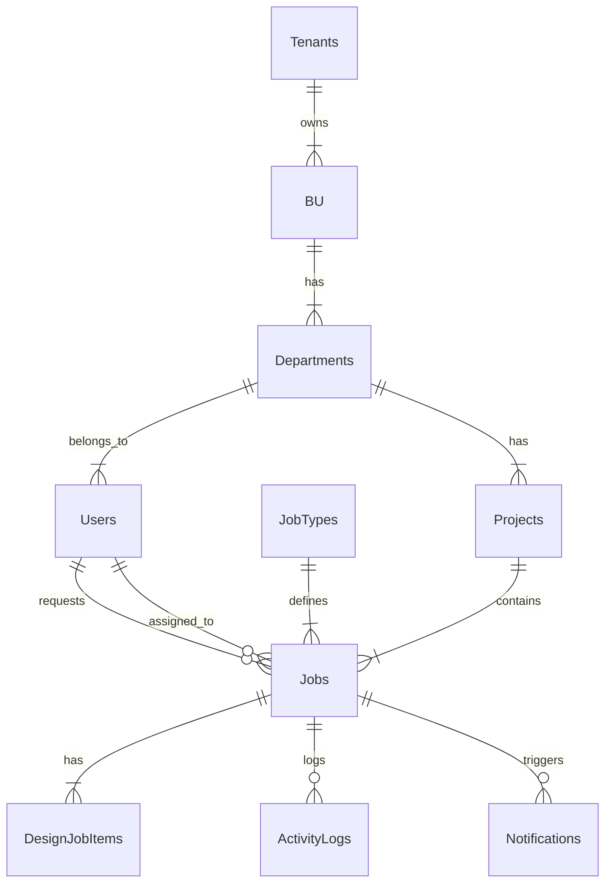

# 🗄️ Database Schema Documentation

## 1. Overview
DJ System uses **PostgreSQL** (via Supabase) with relational data structure.
- **Tenant Isolation:** All main tables have `tenant_id`
- **Naming Convention:** `snake_case` for tables and columns
- **Keys:** `id` (Serial) as Primary Key, Foreign Keys explicitly defined

## 2. Core Tables

### 👥 Organization & Users
| Table | Description | Key Columns |
|-------|-------------|-------------|
| `tenants` | บริษัท/องค์กร | `id`, `name`, `subdomain` |
| `buds` | Business Units | `id`, `tenant_id`, `name` |
| `departments` | แผนก | `id`, `bud_id`, `manager_id` |
| `projects` | โครงการ | `id`, `department_id`, `name` |
| `users` | ข้อมูลผู้ใช้งาน | `id`, `email`, `role`, `department_id` |

### 🛠️ Job Managment
| Table | Description | Key Columns |
|-------|-------------|-------------|
| `job_types` | ประเภทงาน Master | `id`, `name`, `sla_days` |
| `job_type_items` | รายละเอียดงานย่อย | `id`, `job_type_id`, `name` |
| `jobs` | ใบงาน (Transaction) | `id`, `dj_id`, `status`, `requester_id` |
| `design_job_items` | งานย่อยในใบงาน | `id`, `job_id`, `status`, `file_path` |
| `activity_logs` | ประวัติการทำงาน | `id`, `job_id`, `action`, `message` |
| `approval_flows` | ลำดับการอนุมัติ | `id`, `project_id`, `level`, `approver_id` |

---

## 3. Phase 2 Requirement Updates

### 3.1 🤖 Auto-Assignment (Matrix)
Logic: จ่ายงานอัตโนมัติโดยดูจาก **Project** + **Job Type**
- Status: ✅ Already implemented in `schema.sql`

```sql
CREATE TABLE IF NOT EXISTS project_job_assignments (
    id SERIAL PRIMARY KEY,
    project_id INTEGER REFERENCES projects(id),
    job_type_id INTEGER REFERENCES job_types(id),
    assignee_id INTEGER REFERENCES users(id), -- Default Assignee
    UNIQUE(project_id, job_type_id)
);
```

### 3.2 🔔 Notifications (New Required)
Logic: แจ้งเตือนเมื่อสถานะเปลี่ยน หรือใกล้ถึงกำหนด SLA
- Status: ✅ **Implemented** (Phase 2 Migration)

```sql
CREATE TABLE IF NOT EXISTS notifications (
    id SERIAL PRIMARY KEY,
    user_id INTEGER REFERENCES users(id),
    type VARCHAR(50), -- 'job_assigned', 'job_approved', 'sla_warning'
    title VARCHAR(255),
    message TEXT,
    job_id INTEGER REFERENCES jobs(id),
    is_read BOOLEAN DEFAULT false,
    created_at TIMESTAMP WITH TIME ZONE DEFAULT NOW()
);
```

### 3.3 ⏱️ SLA Tracking (New Required)
Logic: เก็บ Log การคำนวณและเลื่อน SLA (Shift)
- Status: ✅ **Implemented** (Phase 2 Migration)

```sql
CREATE TABLE IF NOT EXISTS sla_shift_logs (
    id SERIAL PRIMARY KEY,
    job_id INTEGER REFERENCES jobs(id),
    urgent_job_id INTEGER REFERENCES jobs(id), -- สาเหตุที่ทำให้เลื่อน (งานด่วน)
    original_due_date TIMESTAMP WITH TIME ZONE,
    new_due_date TIMESTAMP WITH TIME ZONE,
    shift_days INTEGER, -- จำนวนวันที่เลื่อน
    created_at TIMESTAMP WITH TIME ZONE DEFAULT NOW()
);
```

## 4. Entity Relationship Diagram (Mermaid)


