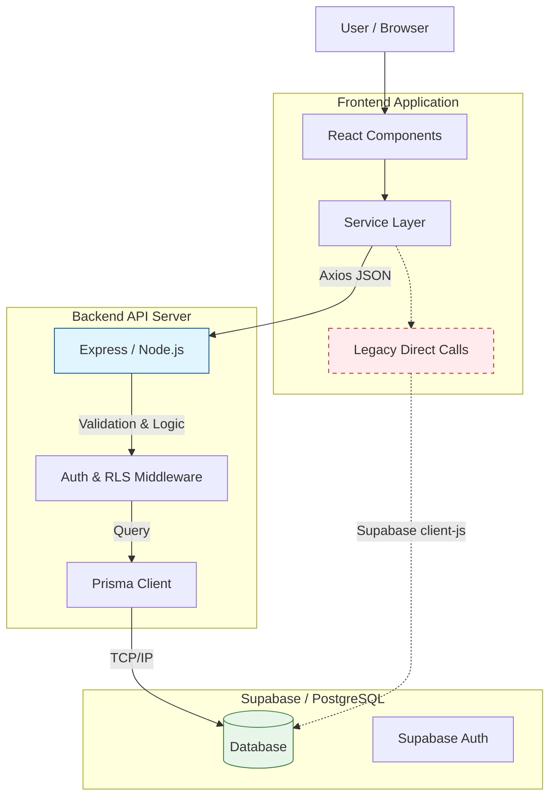
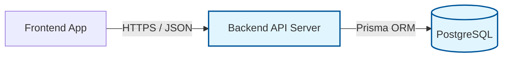
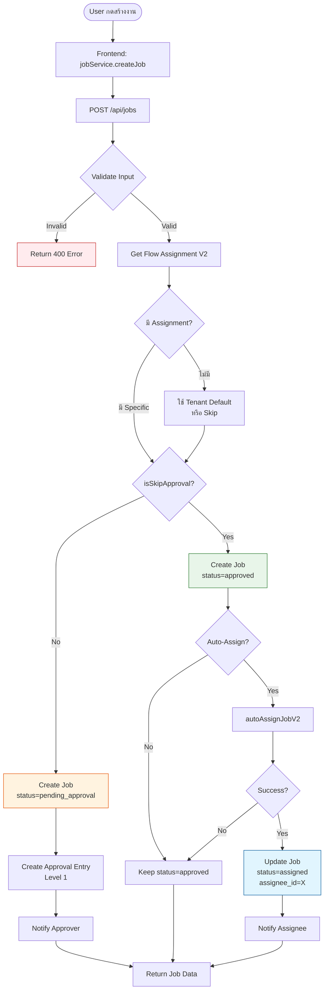

# 🔄 System Data Flow Architecture

## 1. Current State (Hybrid Architecture)
ระบบปัจจุบันอยู่ในช่วง **Transformation** โดยมีการเชื่อมต่อ 2 รูปแบบผสมกัน:



### 🔍 Analysis
1.  **Backend API (Recommended):** Modules ส่วนใหญ่ (เช่น `MasterData`, `Jobs`, `Projects`, `Buds`) ถูกย้ายมาใช้ผ่าน API Server แล้ว เพื่อความปลอดภัยและการจัดการ Logic ที่ซับซ้อน
    *   ✅ Security: ซ่อน Database Credential และ Logic การตรวจสอบสิทธิ์
    *   ✅ Performance: ควบคุม Query และทำ Caching ได้
    
2.  **legacy Direct Calls (To be deprecated):** ยังมีบางจุด (เช่น `createTenant` ใน Admin หรือการดึงข้อมูลดิบบางส่วน) ที่เรียก Supabase โดยตรงผ่าน Frontend
    *   ⚠️ Risk: Business Logic ฝังอยู่หน้าบ้าน แก้ไขยาก

---

## 2. Target Architecture (Phase 3+)
เป้าหมายคือการย้ายทุก Module ให้ผ่าน **API Gateway** เพียงช่องทางเดียว:



## 3. Module Status Check
สถานะการเชื่อมต่อของแต่ละ Module:

| Module | Connection Type | Status | Note |
|--------|----------------|--------|------|
| **Auth** | Hybrid | 🟡 | ใช้ Supabase Auth (Client) + API (Session) |
| **Master Data** | **API** | ✅ | รวม API Departments เรียบร้อยแล้ว |
| **Projects** | **API** | ✅ | ใช้ `httpClient` |
| **BUDs** | **API** | ✅ | ใช้ `httpClient` |
| **Jobs** | **API** | ✅ | ใช้ `httpClient` |
| **Tenants** | Hybrid | 🟡 | `Update` ใช้ API แต่ `Create/Get` บางจุดยังใช้ Direct |
| **Admin Tools** | Hybrid | 🟡 | ยังมี Direct Call หลงเหลือใน `adminService.js` |

---

## 4. Job Creation Flow (V2: Template-Based Approval)

### 4.1 Overview
Flow การสร้างงานใหม่ที่รองรับ **Approval Flow Templates** และ **Skip Approval** Logic



### 4.2 Key Decision Points

#### 4.2.1 Flow Assignment Resolution
```
Priority Order:
1. Project + JobType (Specific)
2. Project + NULL (Default for all JobTypes in Project)
3. Tenant Default (ถ้าไม่มี Assignment)
4. Skip Approval (ถ้าไม่มี Template)
```

#### 4.2.2 Skip Approval Condition
```javascript
isSkipApproval = (assignment?.template?.totalLevels === 0)
```

#### 4.2.3 Auto-Assign Logic
```
IF template.autoAssignType = 'manual' THEN
  → Keep status = 'approved' (รอ Manual Assign)
  
ELSE IF template.autoAssignType = 'team_lead' THEN
  → Find Team Lead of Requester
  → Assign to Team Lead
  
ELSE IF template.autoAssignType = 'dept_manager' THEN
  → Find Department Manager of Requester
  → Assign to Manager
  
ELSE IF template.autoAssignType = 'specific_user' THEN
  → Assign to template.autoAssignUserId
END IF
```

### 4.3 Database Transaction Flow

```sql
-- Transaction Start
BEGIN;

-- Step 1: Create Job
INSERT INTO jobs (tenant_id, project_id, job_type_id, subject, status, ...)
VALUES (...) RETURNING id, dj_id;

-- Step 2: Create Job Items (if any)
INSERT INTO design_job_items (job_id, name, quantity, size, status)
VALUES (...);

-- Step 3a: If NOT Skip → Create Approval Entry
INSERT INTO approvals (tenant_id, job_id, step_number, approver_id, status)
VALUES (...);

-- Step 3b: If Skip + Auto-Assign → Update Job
UPDATE jobs 
SET status = 'assigned', assignee_id = X, started_at = NOW()
WHERE id = Y;

-- Step 4: Handle Urgent Priority (SLA Shift)
-- (Logic in separate service call)

COMMIT;
```

### 4.4 Error Handling

| Error Code | Condition | Action |
|------------|-----------|--------|
| `400` | Missing required fields | Return validation error |
| `403` | User ไม่มีสิทธิ์ใน Project | Return forbidden error |
| `404` | Project/JobType ไม่พบ | Return not found error |
| `500` | Database error | Rollback transaction |
| `500` | Auto-assign failed | Keep status='approved', log error |

### 4.5 Notification Matrix

| Job Status | Recipient | Notification Type |
|------------|-----------|-------------------|
| `pending_approval` | Approver Level 1 | `job_approval_request` |
| `approved` (Manual) | - | - |
| `assigned` | Assignee | `job_assigned` |
| `urgent` + `assigned` | Assignee + Affected Users | `sla_shifted` |
