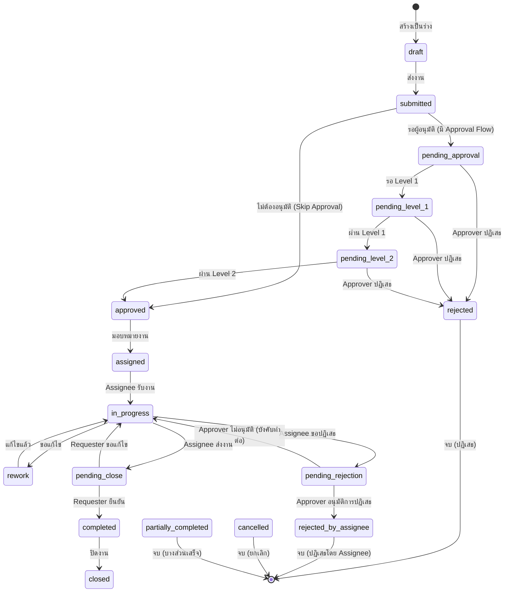
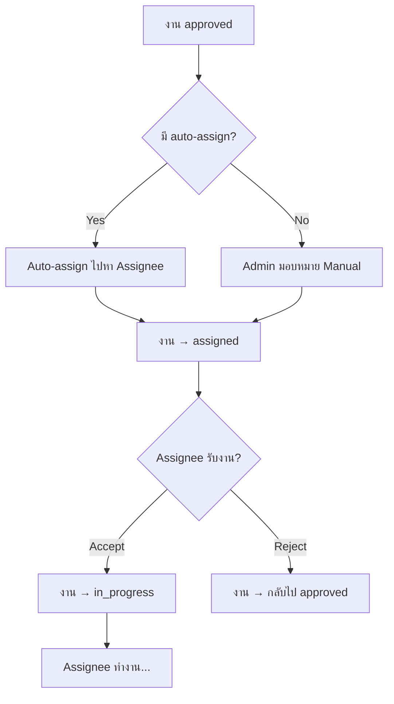
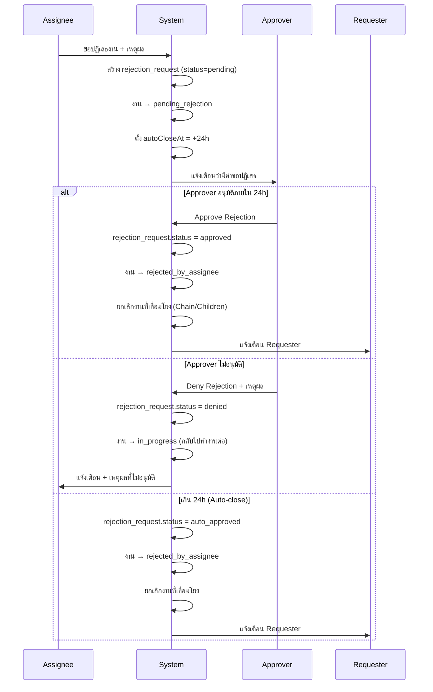

# DJ System - Job Workflow Documentation

เอกสารสรุปขั้นตอนการทำงานของระบบ DJ System
**อัปเดต**: 26 กุมภาพันธ์ 2026

---

## สารบัญ

1. [Job Status Flow ทั้งหมด](#1-job-status-flow-ทั้งหมด)
2. [การอนุมัติงาน (Approval Flow)](#2-การอนุมัติงาน-approval-flow)
3. [การรับงาน (Job Acceptance)](#3-การรับงาน-job-acceptance)
4. [การปฏิเสธงาน (Job Rejection)](#4-การปฏิเสธงาน-job-rejection)
5. [การยกเลิกงาน (Job Cancellation & Chain)](#5-การยกเลิกงาน-job-cancellation--chain)
6. [Parent-Child Jobs](#6-parent-child-jobs)
7. [Job Chaining (Sequential Jobs)](#7-job-chaining-sequential-jobs)
8. [Multi-Role Union View](#8-multi-role-union-view)

---

## 1. Job Status Flow ทั้งหมด

### สถานะงาน (Job Status)



### คำอธิบายสถานะ

| Status | ความหมาย | Who Can See | Actions |
|--------|----------|-------------|---------|
| `draft` | ร่างงาน | Requester | แก้ไข, ลบ, ส่งงาน |
| `submitted` | ส่งงานแล้ว | Requester, Admin | รอระบบจัดการ |
| `pending_approval` | รออนุมัติ Level 1 | Requester, Approver | Approve, Reject |
| `pending_level_1` | รออนุมัติ Level 1 | Requester, Approver | Approve, Reject |
| `pending_level_2` | รออนุมัติ Level 2 | Requester, Approver | Approve, Reject |
| `approved` | อนุมัติแล้ว | Requester, Admin | รอมอบหมาย |
| `assigned` | มอบหมายแล้ว | Requester, Assignee | รับงาน, ปฏิเสธ |
| `in_progress` | กำลังทำงาน | Assignee | ส่งงาน, ขอ Extend, ขอปฏิเสธ |
| `rework` | แก้ไขงาน | Assignee | ส่งงานใหม่ |
| `pending_rejection` | รอ Approver ตอบกลับ | Assignee, Approver | Approve/Deny Rejection |
| `pending_close` | รอ Requester ยืนยัน | Requester, Assignee | Confirm, Request Revision |
| `completed` | เสร็จสมบูรณ์ | ทุกคน | ปิดงาน |
| `closed` | ปิดงานแล้ว | ทุกคน | - |
| `rejected` | ปฏิเสธโดย Approver | ทุกคน | - |
| `rejected_by_assignee` | ปฏิเสธโดย Assignee | ทุกคน | - |
| `cancelled` | ยกเลิก (เนื่องจาก Parent/Chain) | ทุกคน | - |
| `partially_completed` | Parent Job บางส่วนเสร็จ | ทุกคน | - |

---

## 2. การอนุมัติงาน (Approval Flow)

### 2.1 Approval Flow แบบหลายระดับ

```
Requester สร้างงาน
    ↓
งานเข้าสู่ pending_approval
    ↓
Level 1 Approver อนุมัติ
    ↓
งานเข้าสู่ pending_level_2 (ถ้ามี Level 2)
    ↓
Level 2 Approver อนุมัติ
    ↓
งาน = approved → Auto-assign (ถ้าตั้งค่าไว้)
```

### 2.2 Approval Logic

#### ALL (ทุกคนต้องอนุมัติ)
```
Level 1: Approvers = [A, B, C]
Logic = ALL
→ ต้องรอ A, B, C อนุมัติครบทั้ง 3 คนจึงจะผ่าน
```

#### ANY (คนใดคนหนึ่งอนุมัติ)
```
Level 1: Approvers = [A, B, C]
Logic = ANY
→ A, B หรือ C คนใดคนหนึ่งอนุมัติ → ผ่าน Level 1
```

### 2.3 Auto-Approve (Requester = Approver)

**สถานการณ์**: Requester ที่เป็นทั้ง Requester และ Approver สร้างงาน

**Flow:**
```
1. User สร้างงาน
2. ระบบตรวจสอบ: Requester อยู่ใน Level 1 Approvers?
3. ✅ Yes → Auto-approve Level 1 ทันที
4. ถ้ามี Level 2 → งานเข้า pending_level_2
5. ถ้าไม่มี Level 2 → งาน = approved (ผ่านทุก Level)
```

**Backend**: `approvalService.autoApproveIfRequesterIsApprover()`
**ไฟล์**: `backend/api-server/src/services/approvalService.js:1675-1761`

### 2.4 Skip Approval

**สถานการณ์**: งานบางประเภทไม่ต้องอนุมัติ (เช่น งานเร่งด่วนมาก)

**Flow:**
```
1. User สร้างงาน
2. Job Type มี skipApproval = true
3. งานข้าม approval flow ไปเป็น approved ทันที
4. Auto-assign (ถ้าตั้งค่าไว้)
```

### 2.5 API Endpoints

```javascript
// อนุมัติงาน
POST /api/jobs/:id/approve
Body: { comment: "อนุมัติ" }

// ปฏิเสธงาน (Approver)
POST /api/jobs/:id/reject
Body: { comment: "เหตุผล..." }
```

---

## 3. การรับงาน (Job Acceptance)

### 3.1 Assignment Flow



### 3.2 Assignee Actions

#### รับงาน (Accept Job)
```
Status: assigned
Action: Assignee กดรับงาน
API: PUT /api/jobs/:id/accept
Result: status → in_progress, startedAt = now
```

#### ปฏิเสธงาน (Reject Job - เดิม)
```
Status: assigned
Action: Assignee กดปฏิเสธ
API: POST /api/jobs/:id/reject-by-assignee
Body: { comment: "เหตุผล" }
Result: status → rejected_by_assignee
```

#### ขอ Extend Deadline
```
Status: in_progress
Action: Assignee ขอเวลาเพิ่ม
API: POST /api/jobs/:id/extend
Body: { extensionDays: 2, reason: "เหตุผล" }
Result: dueDate += extensionDays
```

### 3.3 การส่งงาน (Complete Job)

```
Status: in_progress
Action: Assignee ส่งงาน
API: POST /api/jobs/:id/complete
Body: { note: "เสร็จแล้ว", attachments: [...] }
Result: status → pending_close
```

---

## 4. การปฏิเสธงาน (Job Rejection)

### 4.1 Rejection Workflow ใหม่ (rejection_requests table)

#### สถานการณ์: Assignee ขอปฏิเสธงานระหว่างทำ (status = in_progress)



### 4.2 API Endpoints (Rejection Request System)

```javascript
// 1. Assignee ขอปฏิเสธงาน
POST /api/jobs/:id/request-rejection
Body: { reason: "เหตุผล..." }
Result:
  - สร้าง rejection_request (status=pending)
  - งาน → pending_rejection
  - autoCloseAt = +24 ชั่วโมง

// 2. Approver อนุมัติคำขอปฏิเสธ
POST /api/rejection-requests/:requestId/approve
Body: { comment: "เห็นด้วย" }
Result:
  - rejection_request.status = approved
  - งาน → rejected_by_assignee
  - ยกเลิก Chained/Child Jobs อัตโนมัติ

// 3. Approver ไม่อนุมัติคำขอปฏิเสธ
POST /api/rejection-requests/:requestId/deny
Body: { reason: "ต้องทำงานต่อ" }
Result:
  - rejection_request.status = denied
  - งาน → in_progress (กลับไปทำต่อ)
  - แนะนำให้ Assignee ขอ Extend แทน
```

### 4.3 Auto-Close Cron Service

**ไฟล์**: `backend/api-server/src/services/rejectionAutoCloseCron.js`

```javascript
// รันทุก 60 นาที
setInterval(() => {
  // 1. หา rejection_requests ที่ status=pending และ autoCloseAt < now
  // 2. สำหรับแต่ละ request:
  //    - rejection_request.status = auto_approved
  //    - งาน → rejected_by_assignee
  //    - ยกเลิกงานที่เชื่อมโยง
  //    - แจ้งเตือน Requester + Assignee
}, 60 * 60 * 1000);
```

### 4.4 การปฏิเสธแบบเดิม (Approver ปฏิเสธตอนอนุมัติ)

```
Status: pending_approval / pending_level_1 / pending_level_2
Action: Approver ปฏิเสธงาน
API: POST /api/jobs/:id/reject
Body: { comment: "เหตุผล" }
Result:
  - งาน → rejected
  - ยกเลิง Chained/Child Jobs อัตโนมัติ
```

---

## 5. การยกเลิกงาน (Job Cancellation & Chain)

### 5.1 Job Chain Cancellation Service

**ไฟล์**: `backend/api-server/src/services/jobChainService.js`

#### ฟังก์ชันหลัก:

**1. cancelChainedJobs (ยกเลิกงานที่ต่อเนื่อง)**
```
สถานการณ์: งาน A ถูกปฏิเสธ, มี Chain A → B → C
Result:
  - B, C ทั้งหมด → cancelled
  - cancellationReason = "Previous job (A) was rejected"
```

**2. cancelChildJobs (ยกเลิกงานลูก)**
```
สถานการณ์: Parent Job ถูกปฏิเสธ
Result:
  - ทุก Child Jobs → cancelled
  - cancellationReason = "Parent job was rejected"
```

**3. checkParentJobClosure (ตรวจสอบ Parent Job ปิดได้หรือไม่)**
```
สถานการณ์: Child Job เสร็จ/ปฏิเสธ
Logic:
  - นับ Child Jobs: completed, rejected, total
  - ถ้า completed = total → Parent = completed
  - ถ้า completed > 0 && rejected > 0 → Parent = partially_completed
  - ถ้า rejected = total → Parent = rejected
  - ถ้ายังมี in_progress → รอต่อ
```

### 5.2 Cancellation Scenarios

#### Scenario 1: Approver ปฏิเสธ Parent Job
```
1. Approver ปฏิเสธ Parent Job
2. Parent Job → rejected
3. ยกเลิก Child Jobs ทั้งหมด → cancelled
4. Log: "Parent job rejected"
```

#### Scenario 2: Assignee ขอปฏิเสธ Child Job
```
1. Assignee ขอปฏิเสธ Child Job
2. Approver อนุมัติ
3. Child Job → rejected_by_assignee
4. ตรวจสอบ Parent Job:
   - ถ้า Child อื่นยังเสร็จ/ปฏิเสธทั้งหมด → Parent = partially_completed
   - ถ้าทุก Child ปฏิเสธ → Parent = rejected
```

#### Scenario 3: งาน Chain A → B → C
```
1. งาน B ถูกปฏิเสธ
2. ระบบยกเลิก C อัตโนมัติ → cancelled
3. A ยังคง status เดิม (ไม่กระทบ)
```

---

## 6. Parent-Child Jobs

### 6.1 Parent Job Structure

```
Parent Job (DJ-260225-0001)
├── Child 1 (DJ-260225-0001-01) - Banner Design
├── Child 2 (DJ-260225-0001-02) - Post Design
└── Child 3 (DJ-260225-0001-03) - Story Design
```

### 6.2 Parent Job Creation

**API**: `POST /api/jobs/parent-child`

```javascript
Body: {
  projectId: 1,
  subject: "Campaign XYZ",
  priority: "high",
  brief: {
    objective: "...",
    headline: "...",
    description: "..."
  },
  jobTypes: [
    { jobTypeId: 1, assigneeId: 10 }, // Banner
    { jobTypeId: 2, assigneeId: 11 }, // Post
    { jobTypeId: 3, assigneeId: 12 }  // Story
  ],
  deadline: "2026-03-01"
}

Result:
  - Parent Job สร้าง (isParent=true)
  - Child Jobs สร้างตาม jobTypes
  - แต่ละ Child มี parentJobId = Parent.id
```

### 6.3 Parent Job Status Rules

| Child Jobs Status | Parent Job Status |
|-------------------|-------------------|
| ทุกตัว completed | completed |
| บางตัว completed + บางตัว rejected | partially_completed |
| ทุกตัว rejected | rejected |
| มี in_progress อยู่ | รอต่อ |

### 6.4 Parent Job Visibility

**Requester**:
- เห็นเฉพาะ Parent Job (ไม่เห็น Child Jobs แยก)
- กดเข้า Parent → เห็น Child Jobs list ข้างใน

**Assignee**:
- เห็นเฉพาะ Child Job ที่ตัวเองรับผิดชอบ
- ไม่เห็น Parent Job

**Approver**:
- เห็น Child Jobs ที่รออนุมัติ
- ไม่เห็น Parent Job (เพราะ Parent ไม่ต้องอนุมัติ)

---

## 7. Job Chaining (Sequential Jobs)

### 7.1 Chain Structure

```
Job A (previousJobId=null, nextJobId=B.id)
  ↓
Job B (previousJobId=A.id, nextJobId=C.id)
  ↓
Job C (previousJobId=B.id, nextJobId=null)
```

### 7.2 Chain Rules

- **Auto-start**: เมื่อ Job A เสร็จ (completed) → Job B auto-start (ถ้าตั้งค่าไว้)
- **Cancellation**: เมื่อ Job B rejected → Job C auto-cancel

### 7.3 Chain Depth Limit

```javascript
chainConfig.maxChainDepth = 5; // สูงสุด 5 งานต่อเนื่อง
```

**เหตุผล**: ป้องกัน infinite loop และการสร้างงานมากเกินไป

---

## 8. Multi-Role Union View

### 8.1 ปัญหาเดิม

```
User มี roles = [Requester, Approver]
GET /api/jobs?role=requester
→ เห็นเฉพาะงานที่สร้าง (Requester)
→ ไม่เห็นงานรออนุมัติ (Approver)
```

### 8.2 วิธีแก้ใหม่

```
User มี roles = [Requester, Approver]
GET /api/jobs?role=requester,approver
→ เห็นทั้งงานที่สร้าง + งานรออนุมัติ (Union)
```

**Backend Logic**:
```sql
WHERE (
  requesterId = userId         -- Requester
  OR
  id IN (pending approval IDs) -- Approver
)
```

**Frontend**:
```javascript
// jobService.js
const roles = ['requester', 'approver'];
const roleParam = roles.join(','); // "requester,approver"
const response = await httpClient.get('/jobs', {
  params: { role: roleParam }
});
```

---

## สรุป API Endpoints ทั้งหมด

### Job CRUD
```
GET    /api/jobs              - ดึงรายการงาน (รองรับ multi-role)
GET    /api/jobs/:id          - ดึงรายละเอียดงาน
POST   /api/jobs              - สร้างงานใหม่
POST   /api/jobs/parent-child - สร้าง Parent + Child Jobs
PUT    /api/jobs/:id          - อัปเดตงาน
DELETE /api/jobs/:id          - ลบงาน
```

### Approval Flow
```
POST   /api/jobs/:id/approve  - อนุมัติงาน (Approver)
POST   /api/jobs/:id/reject   - ปฏิเสธงาน (Approver) + ยกเลิก Chain
```

### Job Actions (Assignee)
```
PUT    /api/jobs/:id/accept   - รับงาน
POST   /api/jobs/:id/complete - ส่งงาน (→ pending_close)
POST   /api/jobs/:id/extend   - ขอ Extend Deadline
```

### Rejection Request System (NEW)
```
POST   /api/jobs/:id/request-rejection           - Assignee ขอปฏิเสธ
POST   /api/rejection-requests/:id/approve       - Approver อนุมัติการปฏิเสธ
POST   /api/rejection-requests/:id/deny          - Approver ไม่อนุมัติ (บังคับทำต่อ)
```

### Requester Actions
```
POST   /api/jobs/:id/confirm-close    - ยืนยันปิดงาน
POST   /api/jobs/:id/request-revision - ขอแก้ไขงาน
```

### Old Rejection Endpoints (ยังใช้ได้)
```
POST   /api/jobs/:id/reject-by-assignee         - Assignee ปฏิเสธตรง (ไม่ผ่าน rejection_request)
POST   /api/jobs/:id/confirm-assignee-rejection - Approver ยืนยันการปฏิเสธ
POST   /api/jobs/:id/deny-assignee-rejection    - Approver ไม่อนุมัติการปฏิเสธ
```

---

## Best Practices

### 1. การใช้ Rejection Request System
✅ **ใช้**: เมื่อ Assignee ต้องการปฏิเสธงานระหว่างทำ (in_progress)
- มี Auto-close (24h)
- มีการแจ้งเตือนอัตโนมัติ
- บันทึก Audit Log

❌ **ไม่ใช้**: เมื่อ Assignee ปฏิเสธก่อนรับงาน (status=assigned)
- ใช้ `/reject-by-assignee` แทน (ไม่ต้องรอ Approver)

### 2. การจัดการ Parent-Child Jobs
✅ **ควร**:
- สร้างผ่าน `/api/jobs/parent-child` endpoint
- ตรวจสอบ Parent Job Status อัตโนมัติหลัง Child เสร็จ/ปฏิเสธ

❌ **ไม่ควร**:
- สร้าง Parent และ Child แยกกัน (เสี่ยง Orphan Jobs)
- ลบ Parent โดยที่ Child ยังไม่เสร็จ

### 3. การใช้ Job Chaining
✅ **ควร**:
- จำกัด Chain Depth ≤ 5
- ใช้กับงานที่ต้องทำตามลำดับจริงๆ

❌ **ไม่ควร**:
- Chain งานที่ทำพร้อมกันได้ (ใช้ Parent-Child แทน)
- Chain งานข้าม Project

---

## Troubleshooting

### ปัญหา: Approver ไม่เห็นงานรออนุมัติ
**สาเหตุ**: User role ไม่ถูกต้อง หรือ frontend ส่ง role parameter ไม่ครบ
**วิธีแก้**: ตรวจสอบ `getJobsByRole()` ส่ง multi-role: `?role=requester,approver`

### ปัญหา: Auto-close ไม่ทำงาน
**สาเหตุ**: Cron service ไม่ได้เริ่มต้น
**วิธีแก้**: ตรวจสอบ `backend/api-server/src/index.js` ว่า `rejectionAutoCloseCron.start()` ถูกเรียกแล้ว

### ปัญหา: งาน Chain ไม่ยกเลิกอัตโนมัติ
**สาเหตุ**: `jobChainService` ไม่ถูกเรียกหลังปฏิเสธงาน
**วิธีแก้**: ตรวจสอบ `/api/jobs/:id/reject` endpoint เรียก `cancelChainedJobs()` แล้ว

### ปัญหา: Parent Job ไม่อัปเดตสถานะ
**สาเหตุ**: Logic ตรวจสอบ Parent Job Closure ไม่ถูกเรียก
**วิธีแก้**: ตรวจสอบ `/api/jobs/:id/complete` endpoint เรียก `checkParentJobClosure()` หลัง Child เสร็จ

---

## อ้างอิง

- [Backend: Job Routes](/backend/api-server/src/routes/jobs.js)
- [Backend: Approval Service](/backend/api-server/src/services/approvalService.js)
- [Backend: Job Chain Service](/backend/api-server/src/services/jobChainService.js)
- [Backend: Rejection Auto-Close Cron](/backend/api-server/src/services/rejectionAutoCloseCron.js)
- [Frontend: Job Service](/frontend/src/modules/shared/services/modules/jobService.js)
- [Frontend: JobDetail Page](/frontend/src/modules/features/job-management/pages/JobDetail.jsx)
- [Database: Prisma Schema](/backend/prisma/schema.prisma)

---

**เอกสารนี้อัปเดตล่าสุด**: 26 กุมภาพันธ์ 2026
**ผู้จัดทำ**: Claude Sonnet 4.5 (DJ System Implementation)
