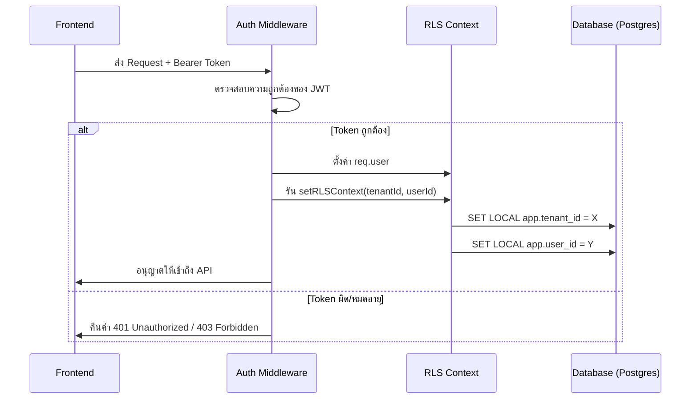

# ระบบยืนยันตัวตนและจัดการสิทธิ์ (Authentication & Security)

เอกสารฉบับนี้อธิบายโครงสร้างและกลไกการทำงานของระบบความปลอดภัยใน DJ-System รวมถึงระบบ V2 Auth และการจัดการสิทธิ์เข้าถึง (RBAC)

---

## 1. โครงสร้างข้อมูลผู้ใช้ (Authentication Data)

**แหล่งที่มา**: `backend/prisma/schema.prisma` (model User, UserRole)

### 1.1 รูปแบบการเก็บข้อมูล
```text
User (ผู้ใช้งาน)
├─ email (Unique)
├─ passwordHash (Bcrypt)
├─ isActive (BOOL)
└─ status (PENDING | APPROVED | REJECTED | INACTIVE)
    └─ ระบบมี Workflow การอนุมัติผู้ใช้ใหม่ (Registration Approval)

UserRole (การเชื่อมโยงบทบาท)
└─ roleName (admin | requester | approver | assignee)
```

---

## 2. ระบบ JWT Token (Stateful & Stateless Flow)

ระบบใช้ JWT (JSON Web Token) ในการยืนยันตัวตน โดยมีรูปแบบ Payload ที่รองรับทั้ง V1 และ V2:

### 2.1 Token Payload Format
```javascript
{
  "sub": "uuid-string",      // มาตรฐาน Supabase
  "userId": 1,               // ID ผู้ใช้ใน Database
  "tenantId": 1,             // ID ขององค์กร (สำคัญมากสำหรับการแยกข้อมูล)
  "email": "user@sena.co.th",
  "roles": ["admin", "requester"] // รายการบทบาท
}
```

### 2.2 กระบวนการยืนยันตัวตน (Middleware Flow)
**ไฟล์หลัก**: `backend/api-server/src/routes/auth.js` (`authenticateToken`)



---

## 3. การจัดการสิทธิ์เข้าถึง (Access Control)

### 3.1 Backend: Role Requirement Middleware
```javascript
// ตัวอย่างการใช้งานใน backend/api-server/src/routes/admin.js
router.get('/settings', requireAdmin, (req, res) => {
    // เฉพาะ Admin เท่านั้นที่เข้าได้
});
```

### 3.2 Frontend: Role Protected Route
**ไฟล์**: `frontend/src/modules/core/auth/RoleProtectedRoute.jsx`

ใช้สำหรับครอบหน้าจอ (Pages) เพื่อป้องกันการเข้าถึงโดยไม่ได้รับอนุญาต:
```jsx
<RoleProtectedRoute allowedRoles={['admin', 'manager']}>
  <AdminDashboard />
</RoleProtectedRoute>
```

---

## 4. ระบบสวมรอย (Impersonation Flow)

ฟีเจอร์สำหรับ Admin ในการสลับ Role ไปเป็น User อื่นเพื่อทดสอบระบบ (ใช้ข้อมูลจริง):

**Backend Logic**: `POST /api/auth/impersonate`
1. ตรวจสอบว่าผู้ใช้ปัจจุบันเป็น **Admin**
2. ค้นหา User เป้าหมายตามบทบาทที่เลือก
3. สร้าง JWT Token ของ User เป้าหมาย แต่แนบ `impersonatedBy: originalAdminId` ไปด้วย
4. คืนค่า Token ใหม่ให้ Frontend เพื่อเปลี่ยนสถานะแอปฯ

---

## 5. การจัดการสิทธิ์ตามขอบเขตงาน (Scope Assignments)

นอกเหนือจาก Role ระบบยังมีการจำกัดสิทธิ์รายโครงการ (Project-based Scope):
- **UserScopeAssignment**: เชื่อมโยง User เข้ากับ Project และ Tenant
- **Logic**: เมื่อสร้างงาน (Create Job) ระบบจะกรองรายการโครงการที่ User มีสิทธิ์ `requester` เท่านั้นมาให้เลือก

---

## ไฟล์ที่เกี่ยวข้อง (Related Files)

| รายการ | เส้นทางไฟล์ (Path) |
| :--- | :--- |
| **Auth Middlewares** | `backend/api-server/src/routes/auth.js` |
| **Auth Service** | `backend/api-server/src/services/userService.js` |
| **User Logic** | `backend/api-server/src/services/userService.js` |
| **Auth Store (FE)** | `frontend/src/modules/core/stores/authStoreV2.js` |
| **Role Guard (FE)** | `frontend/src/modules/core/auth/RoleProtectedRoute.jsx` |

---
**อัปเดตล่าสุด**: 2026-02-11
**สถานะ**: Production Ready
