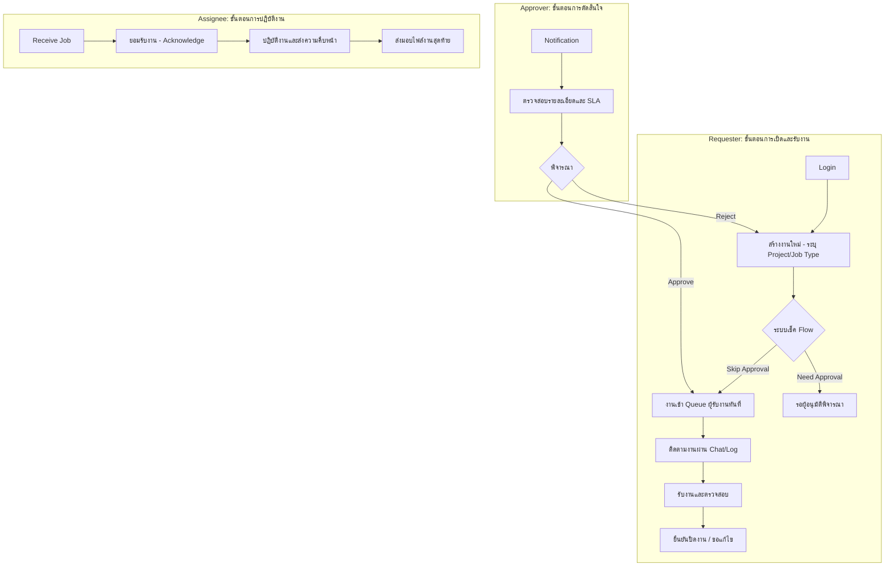

# 📊 รายงานสรุปโครงการ DJ-System ฉบับสมบูรณ์

รายงานฉบับนี้จัดทำขึ้นเพื่อสรุปภาพรวมโครงการ เส้นทางการใช้งาน (User Flow) และประวัติการพัฒนาโดยละเอียด ตั้งแต่เริ่มต้นจนถึงปัจจุบัน

---

## 1. ฟีเจอร์หลักในปัจจุบัน (Key Features by Role)

ระบบถูกออกแบบมาเพื่อรองรับ 4 บทบาทหลัก (Role-Based Access Control):

| บทบาท (Role) | ฟีเจอร์เด่น (Key Features) |
| :--- | :--- |
| **Requester (ผู้เปิดงาน)** | สร้างงาน (Create DJ), แนบไฟล์ Brief, ติดตามสถานะ (My Jobs), คอมเมนต์โต้ตอบ, รับมอบงาน/ยืนยันปิดงาน |
| **Approver (ผู้อนุมัติ)** | ตรวจสอบรายละเอียดงาน, อนุมัติ/ส่งคืน (Approve/Reject), จัดการลำดับการอนุมัติ (Approval Chain) |
| **Assignee (ผู้รับงาน)** | รับงานเข้าคิว (My Queue), อัปเดตความคืบหน้า, ส่งมอบงานศิลป์ (Upload Deliverables) |
| **Admin (ผู้ดูแล)** | จัดการองค์กร (Organization/Dept), จัดการพนักงาน (Users), ตั้งค่า Logic การจ่ายงานอัตโนมัติ (Assignment Matrix) |

---

## 2. เส้นทางผู้ใช้งาน (User Flow - Mermaid Diagram)



---

## 3. ไทม์ไลน์การพัฒนาเชิงลึก (Detailed Timeline & Requirement Changes)

### 📅 สัปดาห์ที่ 1: การวางรากฐาน (Foundation Week)
| วันที่ | กิจกรรมหลัก (Key Activities) | ฟังก์ชันที่ส่งมอบ (Delivered Functions) |
| :--- | :--- | :--- |
| **17 ม.ค. 69** | Project Initialization | โครงสร้าง React, ระบบ Auth เบื้องต้น, หน้า Dashboard, Layout หลัก |
| **18 ม.ค. 69** | UI/UX & Notifications | ระบบแจ้งเตือน (Notifications), ระบบ Chat Alert (Mock), Dashboard KPI Cards |
| **19 ม.ค. 69** | Organization Design | ออกแบบโครงสร้าง Tenant/BUD, ระบบจัดการ User และ Scope การเข้าถึงโปรเจกต์ |
| **20 ม.ค. 69** | Database Integration | **[MAJOR]** เชื่อมต่อ Supabase DB, ย้ายข้อมูล Mock ขึ้น Cloud, เริ่มใช้งาน API จริง |
| **21 ม.ค. 69** | Reliability & Master Data | Reset DB Sequences, ปรับแต่งหน้า Admin (Job Types/SLA), แก้ไข UI Modals |
| **22 ม.ค. 69** | Advanced Logic (Phase 2) | ระบบ Job Chaining (งานต่อเนื่อง), ระบบวันหยุด (Holiday Management), อนุมัติการสมัครสมาชิก |
| **23 ม.ค. 69** | Architecture Upgrade | **[MAJOR]** Refactor สถาปัตยกรรมเป็น Modular (V2) เพื่อความยืดหยุ่นสูงสุด |

---

### 📉 การเปลี่ยนแปลง Requirement และผลกระทบ (Requirement Adjustments)

ตลอดโครงการมีการปรับเปลี่ยน "จุดเปลี่ยน" สำคัญที่ทำให้ต้องแก้ฟีเจอร์ (Gantt Chart Impact):

1.  **Change #2 (24 ม.ค.):** เพิ่มระบบ **Auto-Assignment Matrix** ต่อยอดจากเดิมที่ต้องเลือกมือ ทำให้ต้องสร้างตาราง DB ใหม่และแก้ไขหน้า Create Job ทันที
2.  **Change #4 (31 ม.ค.):** ปรับ **Role Naming Standard** (Marketing -> Requester) และรวมระบบ V2 เข้ากับ V1 DB ทำให้ต้องแก้ Code ทั่วทั้งระบบ (Rename/Migration)
3.  **Change #6 (7 ก.พ.):** เพิ่มระบบ **Sequence Job (Dependency)** ทำให้งานที่เคยเป็นอิสระต่อกัน ต้องเขียน Logic ให้งานลูกรอจนกว่างานแม่จะอนุมัติ (SLA Calculation Update)

---

## 4. แผนโครงการแบบ Gantt Chart (Development Roadmap)

```mermaid
gantt
    title DJ-System Detailed Project Roadmap 2026
    dateFormat  YYYY-MM-DD
    axisFormat  %d %b

    section Week 1: Foundation
    Setup Architecture & UI      :done, w1_1, 2026-01-17, 2026-01-19
    Auth & Dashboard Setup       :done, w1_2, 2026-01-18, 2026-01-20
    Database Migration (Supabase):done, w1_3, 2026-01-20, 2026-01-22
    Modular Refactor (Arch V2)   :done, w1_4, 2026-01-22, 2026-01-23

    section Week 2: Core Workflow
    Job Request & SLA Logic      :done, w2_1, 2026-01-24, 2026-01-27
    Approval Flow V1             :done, w2_2, 2026-01-26, 2026-01-29
    !! CHANGE: Auto-Assignment   :done, c_req1, 2026-01-27, 2026-01-30

    section Week 3: Optimization
    !! CHANGE: Role Standardized :done, c_req2, 2026-01-31, 2026-02-02
    Holiday & Calendar Logic     :done, w3_1, 2026-02-01, 2026-02-04
    User Registration Approval   :done, w3_2, 2026-02-03, 2026-02-06

    section Week 4: Enhancement
    !! CHANGE: Sequential Jobs   :done, c_req3, 2026-02-07, 2026-02-09
    Job Detail V2 Refactor       :done, w4_1, 2026-02-08, 2026-02-10
    Analytics & Reporting        :active, w4_2, 2026-02-10, 2026-02-15
```

---

## 5. บทสรุปสถานะปัจจุบัน (Conclusion)
โครงการ DJ-System ได้ผ่านขั้นตอนการวางระบบพื้นฐานและระบบหลัก (Core Logic) ครบถ้วนแล้ว ปัจจุบันอยู่ในขั้นตอนการเก็บรายละเอียดด้าน Analytics และการเตรียมการ Deploy สู่ระดับ Production โดยมีโครงสร้างที่สะอาดและจัดหมวดหมู่ไฟล์อย่างเป็นระเบียบ (Project Restructuring) พร้อมสำหรับการบำรุงรักษาในระยะยาว

---
*จัดทำโดย: Antigravity Project Manager*
*อัปเดตล่าสุด: 11 กุมภาพันธ์ 2026*
