# ภาพรวมโครงการ DJ-System 🚀

เอกสารฉบับนี้สรุปภาพรวมการพัฒนา แผนผังข้อมูล และช่วงเวลาการดำเนินงาน (Timeline) ของโครงการ DJ-System

## 1. วัตถุประสงค์โครงการ
ระบบบริหารจัดการงานออกแบบ (Design Job Management) สำหรับทีม SENA โดยเน้นความยืดหยุ่นด้วยโครงสร้างแบบ **Modular Architecture** และระบบการอนุมัติงานที่ปรับแต่งได้ตามประเภทงาน (Job Type)

---

## 2. แผนการดำเนินงาน (Timeline - Gantt Chart)

---

## 3. รายละเอียดฟีเจอร์และการแยกฟังก์ชัน (Feature Breakdown)

ระบบถูกออกแบบให้เป็น **Modular (Plug & Play)** แยกฟังก์ชันทำงานออกจากกันอย่างอิสระ:

### 🛠️ Core Modules (ระบบหลัก)
- **Auth Service:** รองรับการ Login/Register และแบ่งสิทธิ์ตาม Role (Admin, Requester, Approver, Assignee)
- **Tenant Management:** จัดการข้อมูลองค์กร ฝ่าย (BUD) และแผนก (Department)
- **User Management:** ระบบอนุมัติการลงทะเบียนและกำหนดขอบเขตงาน (Scope)

### 🎨 Feature Modules (ฟังก์ชันการใช้งาน)
- **Job Request:** การสร้างงานใหม่ รองรับการแนบไฟล์และกำหนด Priority
- **Approval System:** ระบบอนุมัติงานแบบหลายระดับ (Multi-level) และการข้ามการอนุมัติ (Skip Approval) สำหรับงานด่วน
- **Assignment Matrix:** ระบบจ่ายงานอัตโนมัติตามประเภทงานและโครงการ
- **Job Tracking:** ติดตามสถานะงาน ระบบคอมเมนต์ และ Activity Logs

---

## 4. การไหลของข้อมูล (Data Flow)

ผังการทำงานของข้อมูลในระบบปัจจุบันที่ย้ายจาก Auth V2 มายัง V1 Database:

```mermaid
sequenceDiagram
    participant User as ผู้ใช้งาน
    participant Frontend as หน้าจอ (React)
    participant API as Backend (Node.js)
    participant V1_DB as Database (Prisma V1)

    User->>Frontend: กรอกข้อมูล/สร้างงาน
    Frontend->>API: ส่ง Request (JWT Token)
    API->>API: ตรวจสอบสิทธิ์ (Middleware)
    
    alt การสร้างงาน (Job Creation)
        API->>V1_DB: ตรวจสอบ Approval Flow ตาม Job Type
        V1_DB-->>API: คืนค่าการตั้งค่า Flow
        API->>V1_DB: บันทึกงาน (Status: Pending/Assigned)
    else การอนุมัติ (Approval)
        API->>V1_DB: อัปเดตสถานะและบันทึกผู้ปฏิบัติงาน
    end
    
    V1_DB-->>API: ผลการบันทึก
    API-->>Frontend: แจ้งเตือนสถานะความสำเร็จ
    Frontend-->>User: แสดงผลบนหน้าจอ
```

---

## 5. การเปลี่ยนแปลงสำคัญ (Function Separation Logic)

การปรับปรุงระบบล่าสุดได้แยกตรรกะการทำงาน (Logic Separation) ดังนี้:

1.  **Role Separation:** แยกสิทธิ์การมองเห็นแดชบอร์ดชัดเจน (Admin เห็นทั้งหมด, Requester เห็นเฉพาะงานตนเอง, Approver เห็นงานรออนุมัติ)
2.  **Job Type Specific Flow:** แยกตรรกะการอนุมัติออกจากตัวโครงการ (ใน 1 โครงการ งานต่างชนิดกันอาจมี Flow การอนุมัติที่ต่างกันได้)
3.  **Scope Filtering:** ระบบกรองโครงการอัตโนมัติสำหรับ Requester ตามแผนก/ฝ่ายที่สังกัด เพื่อป้องกันความผิดพลาดในการเลือกโครงการ

---
*เอกสารนี้จัดทำโดย: Antigravity Project Manager*
*วันที่: 11 กุมภาพันธ์ 2026*
